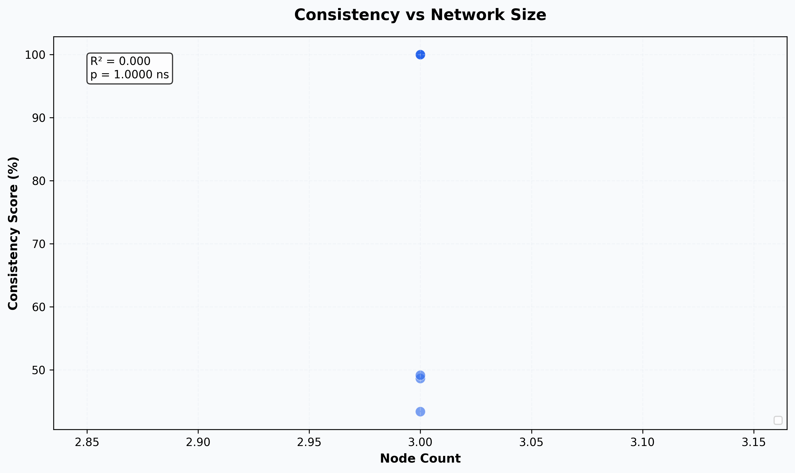
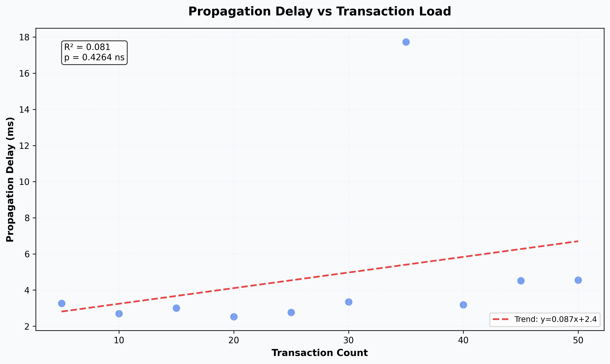
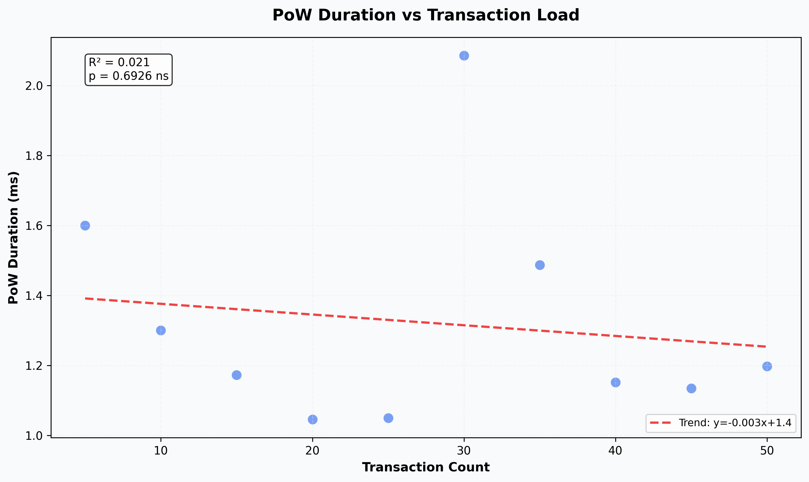
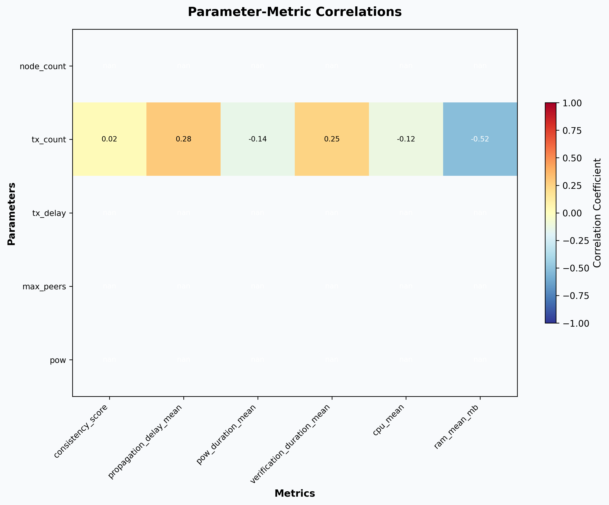
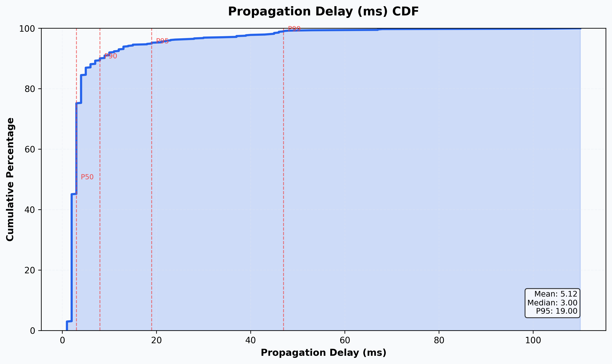
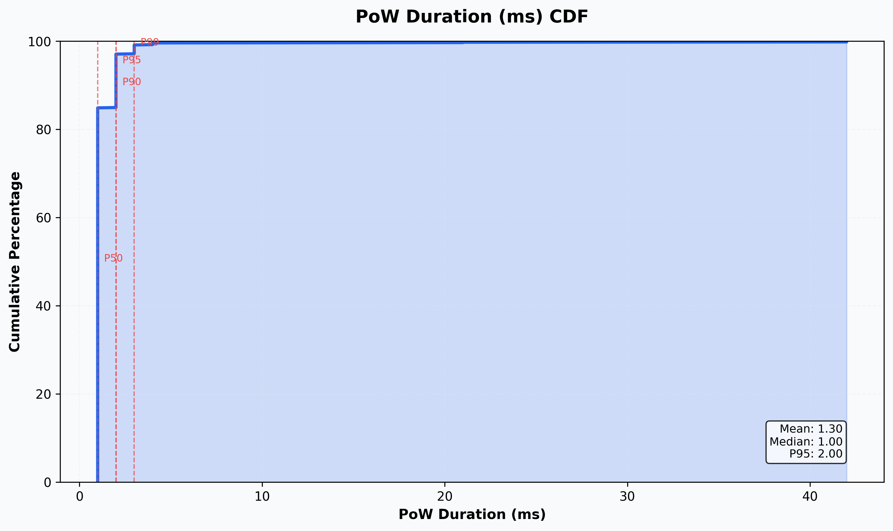

# Multi-Run Tangle Simulation Analysis Report

*Generated: 2026-05-02T19:07:09.159658*  
*Script Version: 2.0.0*  
*Runs Analyzed: 10*

---

## Abstract

This report presents a comparative analysis of **10** tangle simulation runs. 
The analysis examines how key performance metrics—consistency, propagation delay, 
and computational overhead—scale with network parameters. Statistical correlations 
and regression analyses are provided to quantify relationships between simulation 
parameters and outcomes.

## 1. Methodology

### 1.1 Dataset Description

A total of 10 simulation runs were analyzed. 
Each run represents a complete execution of the Docknet tangle simulation 
with varying parameters including node count, transaction load, and network topology.


### 1.2 Metrics Computed

- **Consistency Score**: Percentage of transactions fully replicated across all nodes

- **Propagation Delay**: Time for transactions to reach all nodes

- **Consensus Duration**: Time to reach consensus per transaction

- **PoW Duration**: Proof-of-Work computation time

- **Resource Utilization**: CPU and memory consumption


### 1.3 Statistical Methods

Pearson correlation coefficients and linear regression were used to quantify 
relationships between parameters and outcomes. P-values indicate statistical 
significance (*p<0.05, **p<0.01, ***p<0.001). R² values represent the proportion 
of variance explained by the model.


## 2. Run Summary

**Table 1.** Summary of analyzed simulation runs.


|        Run Id |   Node Count |   Tx Count |   Tx Delay |   Max Peers |   Pow |   Consistency Score |   Propagation Delay Mean |   Pow Duration Mean |
|--------------:|-------------:|-----------:|-----------:|------------:|------:|--------------------:|-------------------------:|--------------------:|
| 1777669874.00 |         3.00 |      40.00 |     300.00 |        5.00 |  1.00 |              100.00 |                     3.19 |                1.15 |
| 1777613189.00 |         3.00 |      35.00 |     300.00 |        5.00 |  1.00 |               43.40 |                    17.73 |                1.49 |
| 1777603437.00 |         3.00 |      30.00 |     300.00 |        5.00 |  1.00 |              100.00 |                     3.34 |                2.09 |
| 1777595203.00 |         3.00 |      25.00 |     300.00 |        5.00 |  1.00 |               48.68 |                     2.76 |                1.05 |
| 1777588445.00 |         3.00 |      20.00 |     300.00 |        5.00 |  1.00 |               49.18 |                     2.52 |                1.05 |
| 1777583217.00 |         3.00 |      15.00 |     300.00 |        5.00 |  1.00 |              100.00 |                     3.00 |                1.17 |
| 1777421572.00 |         3.00 |      45.00 |     300.00 |        5.00 |  1.00 |              100.00 |                     4.51 |                1.13 |
| 1777405786.00 |         3.00 |      50.00 |     300.00 |        5.00 |  1.00 |              100.00 |                     4.55 |                1.20 |
| 1777238132.00 |         3.00 |      10.00 |     300.00 |        5.00 |  1.00 |              100.00 |                     2.70 |                1.30 |
| 1777236195.00 |         3.00 |       5.00 |     300.00 |        5.00 |  1.00 |              100.00 |                     3.27 |                1.60 |


## 3. Descriptive Statistics

**Table 2.** Descriptive statistics for key metrics across all runs.


|       |   duration_hours |   tx_delay |   pow_duration_mean |   pow_duration_median |   pow_duration_std |   verification_duration_mean |   verification_duration_median |   verification_duration_std |   completion_duration_mean |   completion_duration_median |   completion_duration_std |   propagation_delay_mean |   propagation_delay_median |   propagation_delay_std |   consistency_score |   cpu_mean |   cpu_max |   ram_mean_mb |   ram_max_mb |
|:------|-----------------:|-----------:|--------------------:|----------------------:|-------------------:|-----------------------------:|-------------------------------:|----------------------------:|---------------------------:|-----------------------------:|--------------------------:|-------------------------:|---------------------------:|------------------------:|--------------------:|-----------:|----------:|--------------:|-------------:|
| count |           10.000 |     10.000 |              10.000 |                10.000 |             10.000 |                       10.000 |                         10.000 |                      10.000 |                     10.000 |                       10.000 |                    10.000 |                   10.000 |                     10.000 |                  10.000 |              10.000 |     10.000 |    10.000 |        10.000 |       10.000 |
| mean  |            2.490 |    300.000 |               1.322 |                 1.000 |              1.190 |                        6.567 |                          4.200 |                       7.473 |                      2.603 |                        1.100 |                     8.525 |                    4.757 |                      3.100 |                   5.175 |              84.126 |      0.727 |    53.925 |       875.208 |     1488.900 |
| std   |            1.297 |      0.000 |               0.323 |                 0.000 |              1.772 |                        5.676 |                          2.440 |                       6.994 |                      2.875 |                        0.316 |                    18.368 |                    4.611 |                      1.449 |                   6.414 |              25.604 |      0.163 |    19.157 |       160.371 |      381.681 |
| min   |            0.535 |    300.000 |               1.045 |                 1.000 |              0.219 |                        3.983 |                          3.000 |                       2.270 |                      1.224 |                        1.000 |                     0.507 |                    2.522 |                      2.000 |                   0.702 |              43.396 |      0.540 |    22.682 |       760.926 |      964.000 |
| 25%   |            1.556 |    300.000 |               1.139 |                 1.000 |              0.351 |                        4.218 |                          3.000 |                       4.630 |                      1.405 |                        1.000 |                     0.677 |                    2.822 |                      2.250 |                   1.572 |              61.885 |      0.662 |    37.500 |       776.292 |     1285.750 |
| 50%   |            2.495 |    300.000 |               1.185 |                 1.000 |              0.472 |                        4.711 |                          3.500 |                       5.338 |                      1.667 |                        1.000 |                     2.597 |                    3.228 |                      3.000 |                   3.470 |             100.000 |      0.715 |    60.193 |       792.661 |     1410.500 |
| 75%   |            3.453 |    300.000 |               1.440 |                 1.000 |              0.840 |                        5.447 |                          4.000 |                       6.772 |                      1.946 |                        1.000 |                     5.168 |                    4.221 |                      3.000 |                   5.030 |             100.000 |      0.746 |    66.667 |       896.504 |     1806.250 |
| max   |            4.382 |    300.000 |               2.085 |                 1.000 |              5.928 |                       22.580 |                         11.000 |                      26.227 |                     10.697 |                        2.000 |                    60.327 |                   17.728 |                      7.000 |                  22.232 |             100.000 |      1.143 |    75.000 |      1174.108 |     2039.000 |


## 4. Trend Analysis


### 4.1 Consistency vs Node Count

**Figure 1.** Relationship between network size and consistency score. 
The regression analysis shows a not significant trend (R²=0.000, p=1.0000) 
where consistency decreases with node count (slope=0.000).





### 4.-1. Propagation Delay vs Transaction Load

Regression analysis: R²=0.081, p=0.4264 (not significant).





### 4.0. PoW Duration vs Transaction Load

Regression analysis: R²=0.021, p=0.6926 (not significant).





## 5. Correlation Analysis

**Figure 4.** Pearson correlation matrix between simulation 
parameters (rows) and performance metrics (columns). 
Values range from -1 (strong negative) to +1 (strong positive).





**Table 3.** Key statistically significant correlations (p<0.05).


## 6. Distribution Analysis


### 6.-1. Propagation Delay (ms) Distribution

**Figure 5.** Cumulative distribution function 
for propagation delay (ms) across all transactions.





### 6.0. Consensus Duration (ms) Distribution


### 6.1. PoW Duration (ms) Distribution

**Figure 7.** Cumulative distribution function 
for pow duration (ms) across all transactions.





## 7. Individual Run Summaries

Detailed analysis for each simulation run follows.


### 7.1. Run 1777669874

**Parameters:**

| Parameter   |   Value |
|:------------|--------:|
| node_count  |       3 |
| tx_count    |      40 |
| tx_delay    |     300 |
| max_peers   |       5 |
| pow         |       1 |
| wait        |     600 |


**Key Metrics:**

| Metric              | Value   |
|:--------------------|:--------|
| Total Nodes         | 3       |
| Total Transactions  | 363     |
| Unique Transactions | 121     |
| Consistency Score   | 100.00% |
| Duration (hours)    | 3.53    |
| Avg CPU %           | 0.54    |
| Avg RAM (MB)        | 760.93  |


### 7.2. Run 1777613189

**Parameters:**

| Parameter   |   Value |
|:------------|--------:|
| node_count  |       3 |
| tx_count    |      35 |
| tx_delay    |     300 |
| max_peers   |       5 |
| pow         |       1 |
| wait        |     600 |


**Key Metrics:**

| Metric              | Value   |
|:--------------------|:--------|
| Total Nodes         | 3       |
| Total Transactions  | 258     |
| Unique Transactions | 106     |
| Consistency Score   | 43.40%  |
| Duration (hours)    | 3.23    |
| Avg CPU %           | 1.14    |
| Avg RAM (MB)        | 802.65  |


### 7.3. Run 1777603437

**Parameters:**

| Parameter   |   Value |
|:------------|--------:|
| node_count  |       3 |
| tx_count    |      30 |
| tx_delay    |     300 |
| max_peers   |       5 |
| pow         |       1 |
| wait        |     600 |


**Key Metrics:**

| Metric              | Value   |
|:--------------------|:--------|
| Total Nodes         | 3       |
| Total Transactions  | 273     |
| Unique Transactions | 91      |
| Consistency Score   | 100.00% |
| Duration (hours)    | 2.71    |
| Avg CPU %           | 0.73    |
| Avg RAM (MB)        | 779.36  |


### 7.4. Run 1777595203

**Parameters:**

| Parameter   |   Value |
|:------------|--------:|
| node_count  |       3 |
| tx_count    |      25 |
| tx_delay    |     300 |
| max_peers   |       5 |
| pow         |       1 |
| wait        |     600 |


**Key Metrics:**

| Metric              | Value   |
|:--------------------|:--------|
| Total Nodes         | 3       |
| Total Transactions  | 189     |
| Unique Transactions | 76      |
| Consistency Score   | 48.68%  |
| Duration (hours)    | 2.28    |
| Avg CPU %           | 0.75    |
| Avg RAM (MB)        | 775.27  |


### 7.5. Run 1777588445

**Parameters:**

| Parameter   |   Value |
|:------------|--------:|
| node_count  |       3 |
| tx_count    |      20 |
| tx_delay    |     300 |
| max_peers   |       5 |
| pow         |       1 |
| wait        |     600 |


**Key Metrics:**

| Metric              | Value   |
|:--------------------|:--------|
| Total Nodes         | 3       |
| Total Transactions  | 152     |
| Unique Transactions | 61      |
| Consistency Score   | 49.18%  |
| Duration (hours)    | 1.87    |
| Avg CPU %           | 0.71    |
| Avg RAM (MB)        | 782.68  |


### 7.6. Run 1777583217

**Parameters:**

| Parameter   |   Value |
|:------------|--------:|
| node_count  |       3 |
| tx_count    |      15 |
| tx_delay    |     300 |
| max_peers   |       5 |
| pow         |       1 |
| wait        |     600 |


**Key Metrics:**

| Metric              | Value   |
|:--------------------|:--------|
| Total Nodes         | 3       |
| Total Transactions  | 138     |
| Unique Transactions | 46      |
| Consistency Score   | 100.00% |
| Duration (hours)    | 1.45    |
| Avg CPU %           | 0.72    |
| Avg RAM (MB)        | 764.87  |


### 7.7. Run 1777421572

**Parameters:**

| Parameter   |   Value |
|:------------|--------:|
| node_count  |       3 |
| tx_count    |      45 |
| tx_delay    |     300 |
| max_peers   |       5 |
| pow         |       1 |
| wait        |     600 |


**Key Metrics:**

| Metric              | Value   |
|:--------------------|:--------|
| Total Nodes         | 3       |
| Total Transactions  | 408     |
| Unique Transactions | 136     |
| Consistency Score   | 100.00% |
| Duration (hours)    | 3.96    |
| Avg CPU %           | 0.58    |
| Avg RAM (MB)        | 836.44  |


### 7.8. Run 1777405786

**Parameters:**

| Parameter   |   Value |
|:------------|--------:|
| node_count  |       3 |
| tx_count    |      50 |
| tx_delay    |     300 |
| max_peers   |       5 |
| pow         |       1 |
| wait        |     600 |


**Key Metrics:**

| Metric              | Value   |
|:--------------------|:--------|
| Total Nodes         | 3       |
| Total Transactions  | 453     |
| Unique Transactions | 151     |
| Consistency Score   | 100.00% |
| Duration (hours)    | 4.38    |
| Avg CPU %           | 0.67    |
| Avg RAM (MB)        | 916.52  |


### 7.9. Run 1777238132

**Parameters:**

| Parameter   |   Value |
|:------------|--------:|
| node_count  |       3 |
| tx_count    |      10 |
| tx_delay    |     300 |
| max_peers   |       5 |
| pow         |       1 |
| wait        |     300 |


**Key Metrics:**

| Metric              | Value   |
|:--------------------|:--------|
| Total Nodes         | 3       |
| Total Transactions  | 93      |
| Unique Transactions | 31      |
| Consistency Score   | 100.00% |
| Duration (hours)    | 0.95    |
| Avg CPU %           | 0.66    |
| Avg RAM (MB)        | 1159.25 |


### 7.10. Run 1777236195

**Parameters:**

| Parameter   |   Value |
|:------------|--------:|
| node_count  |       3 |
| tx_count    |       5 |
| tx_delay    |     300 |
| max_peers   |       5 |
| pow         |       1 |
| wait        |     300 |


**Key Metrics:**

| Metric              | Value   |
|:--------------------|:--------|
| Total Nodes         | 3       |
| Total Transactions  | 48      |
| Unique Transactions | 16      |
| Consistency Score   | 100.00% |
| Duration (hours)    | 0.54    |
| Avg CPU %           | 0.77    |
| Avg RAM (MB)        | 1174.11 |


## 8. Conclusions

This analysis examined 
**10** simulation runs with varying network parameters. 
Key findings include:


- Average consistency score across all runs: **84.13%**


## Appendix

### A. Run IDs Used

```

1777669874, 1777613189, 1777603437, 1777595203, 1777588445, 1777583217, 1777421572, 1777405786, 1777238132, 1777236195

```


### B. Technical Details

| Field            | Value                      |
|:-----------------|:---------------------------|
| Generated At     | 2026-05-02T19:07:12.666844 |
| Script Version   | 2.0.0                      |
| Database Path    | /data/db.sqlite3           |
| Runs Analyzed    | 10                         |
| Charts Generated | 6                          |
| Python Version   | 3.9.2                      |

