# Tangle Simulation Report — Run 1777236195

*Generated: 2026-04-26T21:15:25.838593*

*Script version: 1.0.0*

---

## Run Summary

| Metric               | Value               |
|:---------------------|:--------------------|
| Run ID               | 1777236195          |
| Status               | complete            |
| Started              | 2026-04-26 20:43:15 |
| Ended                | 2026-04-26 21:15:22 |
| Duration             | 0:32:07             |
| Node Count (params)  | 3                   |
| Tx Count (params)    | 5                   |
| Tx Delay (ms)        | 300                 |
| Max Peers            | 5                   |
| PoW                  | 1                   |
| Wait (ms)            | 300                 |
| Total Nodes (actual) | 3                   |
| Total Transactions   | 48                  |
| Unique Transactions  | 16                  |
| Total Hops           | 78                  |
| Total Peers          | 6                   |
| Metrics Records      | 5445                |

## Node Overview

|   Index | Node ID                 |   Tx Count |   Peer Count |   Has Metrics |
|--------:|:------------------------|-----------:|-------------:|--------------:|
|       1 | Rke11ukxmfgXWe2dG98t... |         16 |            2 |             1 |
|       2 | YQnryJGu+gKTwQbTfKLL... |         16 |            2 |             1 |
|       3 | ewMU3eFfgOTS4VbQjtP3... |         16 |            2 |             1 |

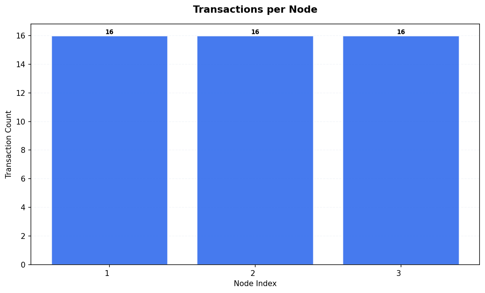

## Transaction Timing Statistics

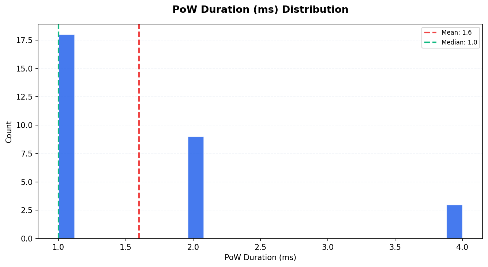

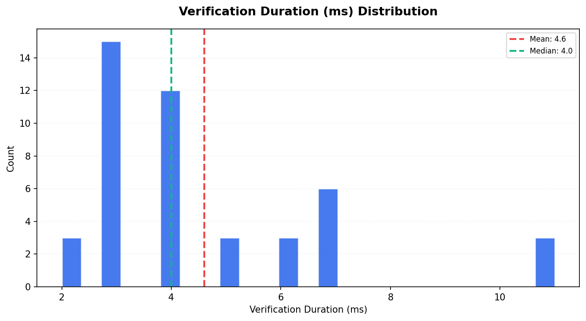

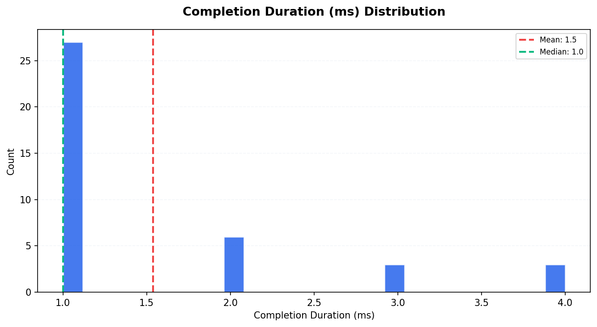

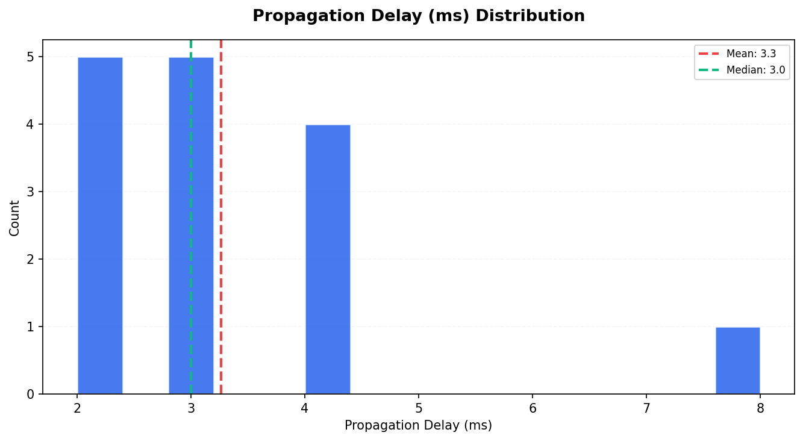

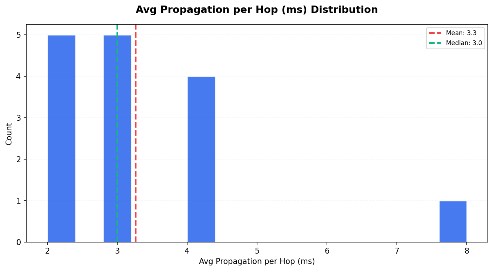

| Metric                       |   Count |   Mean |   Median |   P95 |
|:-----------------------------|--------:|-------:|---------:|------:|
| PoW Duration (ms)            |      30 |   1.6  |        1 |   4   |
| Consensus Duration (ms)      |       0 |   0    |        0 |   0   |
| Verification Duration (ms)   |      45 |   4.6  |        4 |  10.2 |
| Completion Duration (ms)     |      39 |   1.54 |        1 |   4   |
| Propagation Delay (ms)       |      15 |   3.27 |        3 |   5.2 |
| Avg Propagation per Hop (ms) |      15 |   3.27 |        3 |   5.2 |

## Consistency Analysis

| Metric                  | Value   |
|:------------------------|:--------|
| Consistency Score       | 100.00% |
| Fully Replicated Tx     | 16      |
| Partially Replicated Tx | 0       |
| Total Unique Tx         | 16      |
| Parent Conflicts        | 0       |
| Signature Conflicts     | 0       |
| Data Conflicts          | 0       |
| Weight Differences      | 0       |
| Consensus Differences   | 0       |

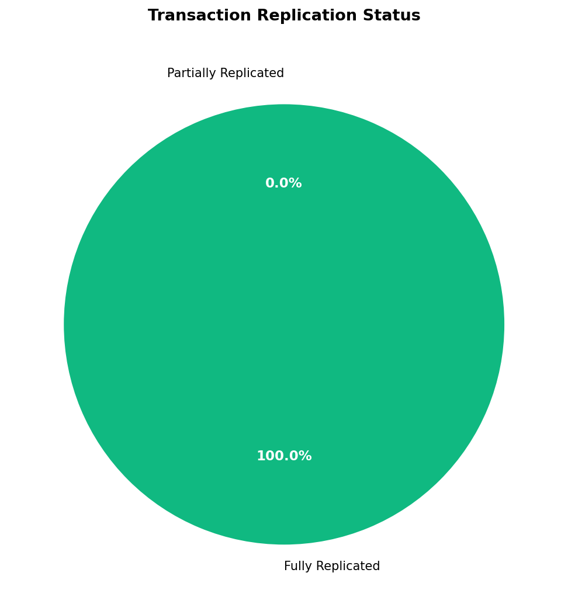

### Replication Distribution

How many nodes have each transaction:

| Node Count   |   Transactions |
|:-------------|---------------:|
| 3 nodes      |             16 |

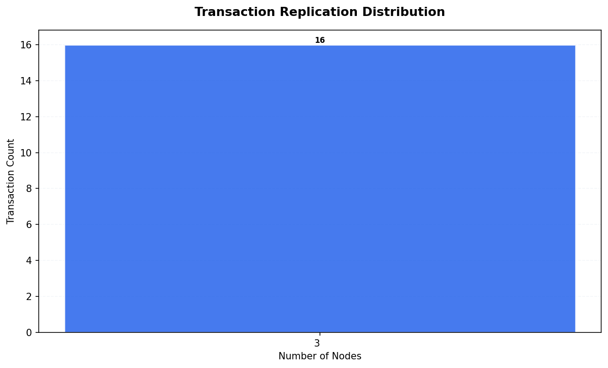

## Peer Topology

| Metric                 |   Value |
|:-----------------------|--------:|
| Total Peer Connections |       6 |
| Avg Peers per Node     |       2 |
| Isolated Nodes         |       0 |
| Peers in state 2       |       6 |

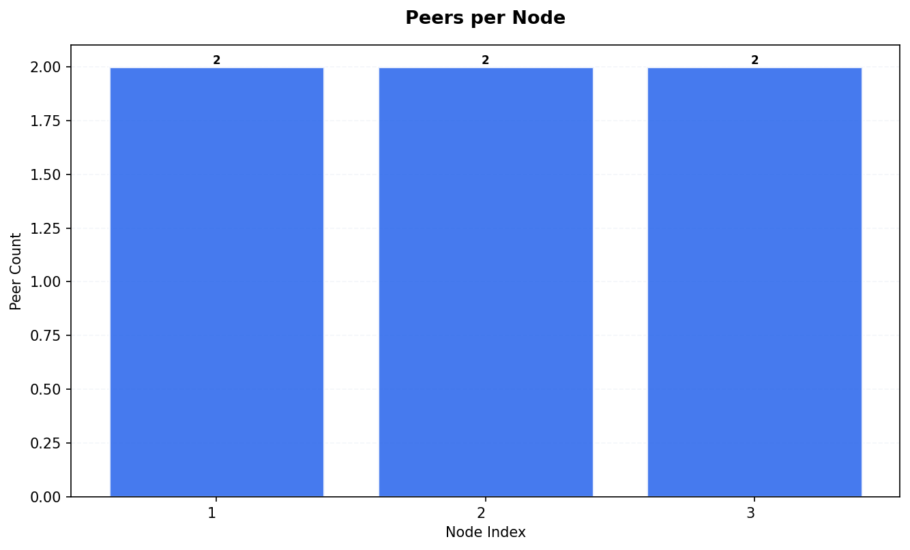

## Resource Metrics

Total metric records: 5445

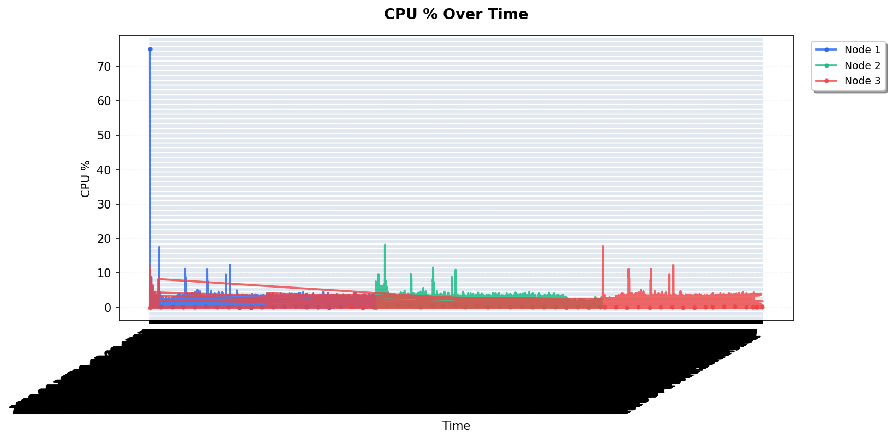

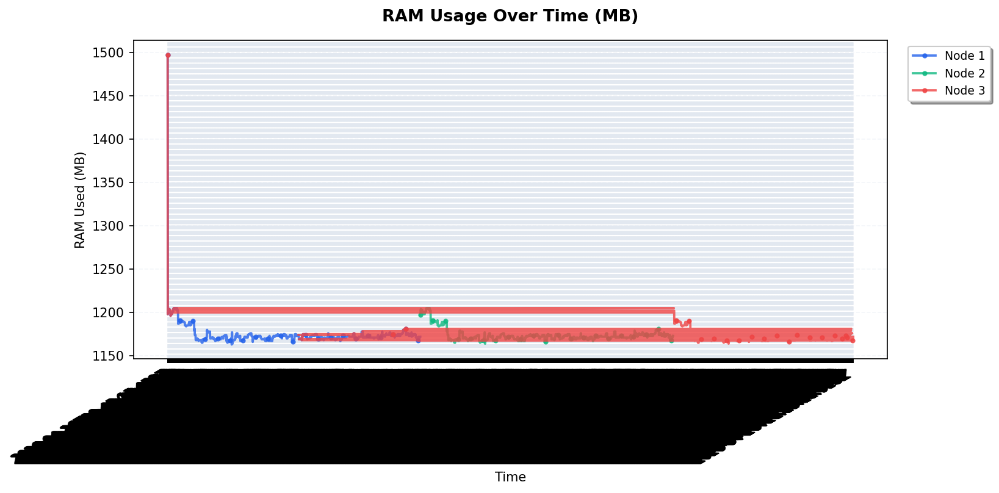

### RAM Statistics per Node

|   Node |   Avg RAM Used (MB) |   Max RAM Used (MB) |   Total RAM (MB) |
|-------:|--------------------:|--------------------:|-----------------:|
|      1 |             1174.16 |                1497 |             3583 |
|      2 |             1174    |                1205 |             3583 |
|      3 |             1174.16 |                1497 |             3583 |

## Appendix

| Field           | Value                      |
|:----------------|:---------------------------|
| Generated At    | 2026-04-26T21:17:04.324506 |
| Script Version  | 1.0.0                      |
| Database Path   | /data/db.sqlite3           |
| Run ID          | 1777236195                 |
| Internal Run ID | 2                          |
| Charts Created  | 11                         |

