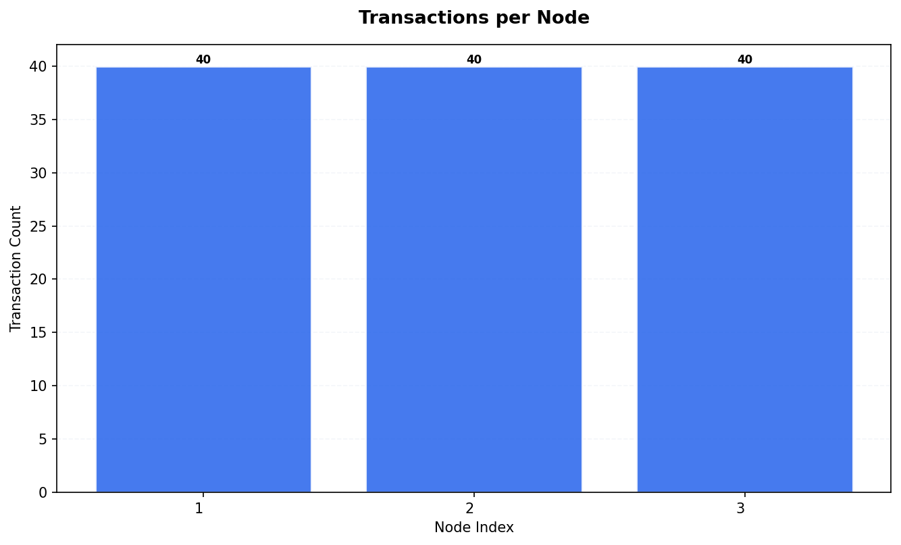
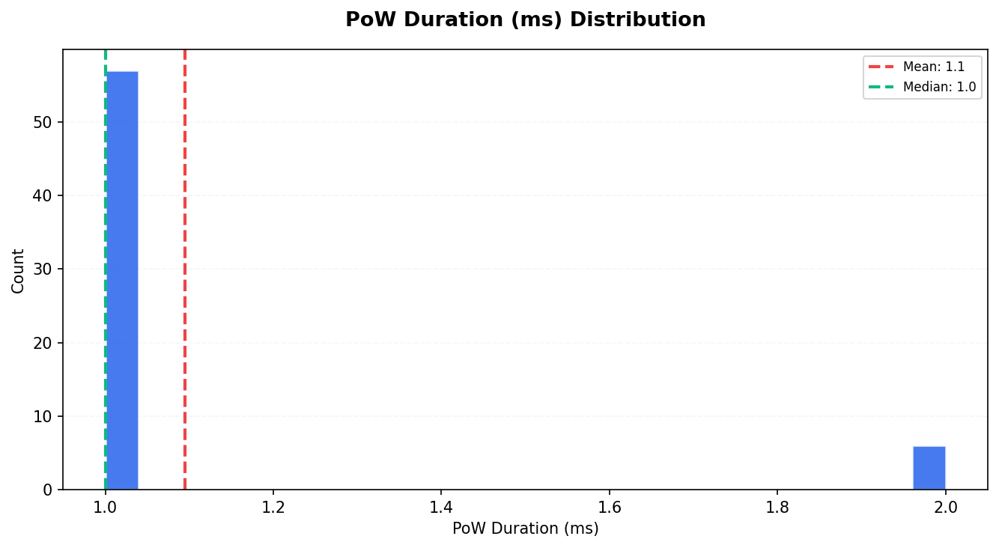
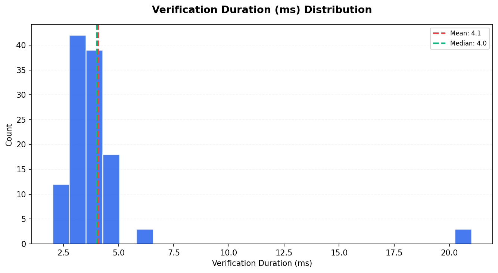
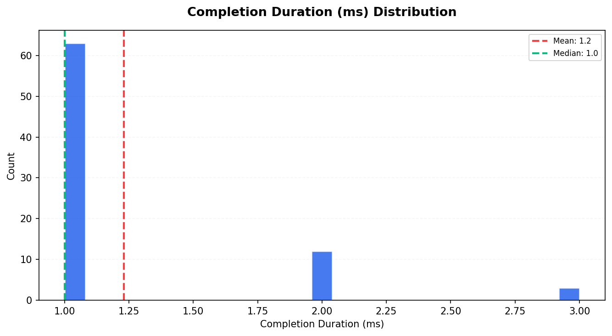
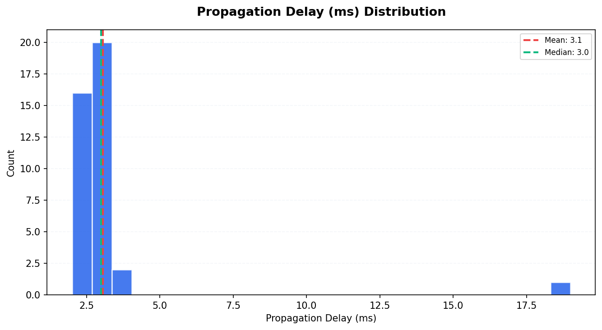
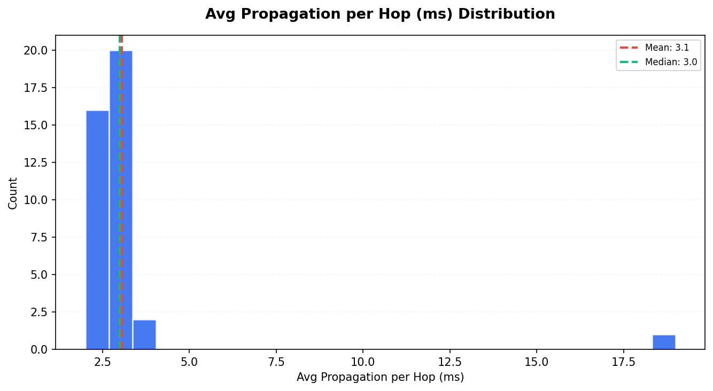
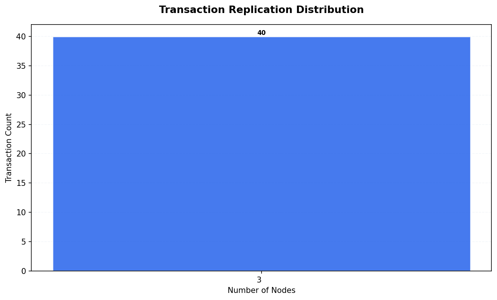
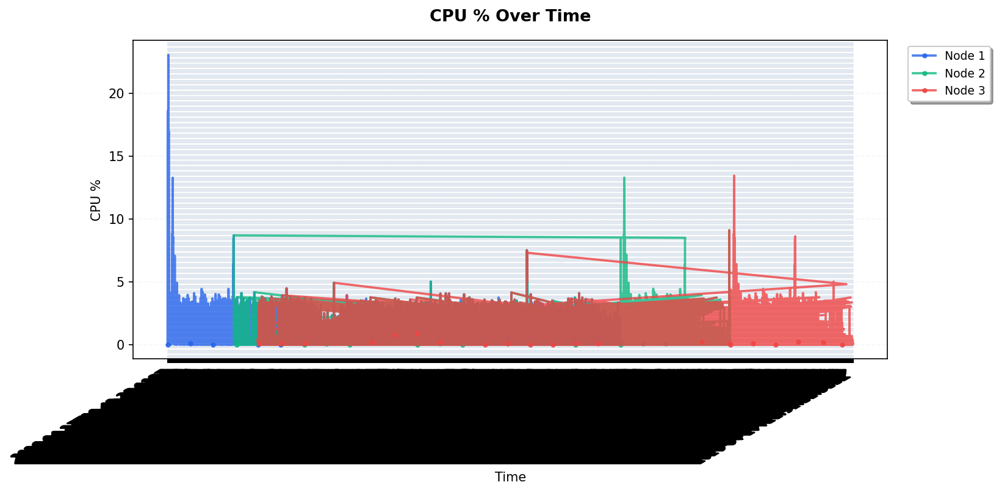
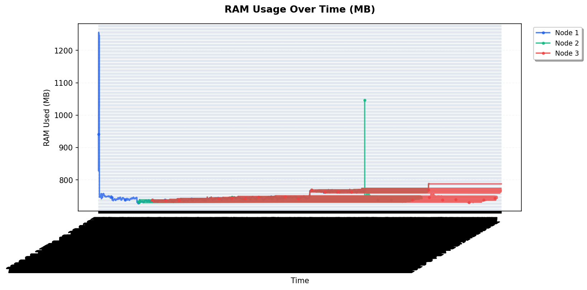

# Tangle Simulation Report — Run 1777322466

*Generated: 2026-04-27T21:52:52.981516*

*Script version: 1.0.0*

---

## Run Summary

| Metric               | Value               |
|:---------------------|:--------------------|
| Run ID               | 1777322466          |
| Status               | complete            |
| Started              | 2026-04-27 20:41:06 |
| Ended                | 2026-04-27 21:52:51 |
| Duration             | 1:11:45             |
| Node Count (params)  | 3                   |
| Tx Count (params)    | 35                  |
| Tx Delay (ms)        | 300                 |
| Max Peers            | 5                   |
| PoW                  | 1                   |
| Wait (ms)            | 300                 |
| Total Nodes (actual) | 3                   |
| Total Transactions   | 120                 |
| Unique Transactions  | 40                  |
| Total Hops           | 198                 |
| Total Peers          | 6                   |
| Metrics Records      | 12642               |

## Node Overview

|   Index | Node ID                 |   Tx Count |   Peer Count |   Has Metrics |
|--------:|:------------------------|-----------:|-------------:|--------------:|
|       1 | Fd7w4QppVaBCaosOVzW+... |         40 |            2 |             1 |
|       2 | ubcxJUqDwBr29lo5yzNV... |         40 |            2 |             1 |
|       3 | 22CziKuu4FP6UzT/Sj87... |         40 |            2 |             1 |

## Transaction Timing Statistics

| Metric                       |   Count |   Mean |   Median |   P95 |
|:-----------------------------|--------:|-------:|---------:|------:|
| PoW Duration (ms)            |      63 |   1.1  |        1 |   2   |
| Consensus Duration (ms)      |       0 |   0    |        0 |   0   |
| Verification Duration (ms)   |     117 |   4.08 |        4 |   5.2 |
| Completion Duration (ms)     |      78 |   1.23 |        1 |   2   |
| Propagation Delay (ms)       |      39 |   3.05 |        3 |   4   |
| Avg Propagation per Hop (ms) |      39 |   3.05 |        3 |   4   |

## Consistency Analysis

| Metric                  | Value   |
|:------------------------|:--------|
| Consistency Score       | 100.00% |
| Fully Replicated Tx     | 40      |
| Partially Replicated Tx | 0       |
| Total Unique Tx         | 40      |
| Parent Conflicts        | 0       |
| Signature Conflicts     | 0       |
| Data Conflicts          | 0       |
| Weight Differences      | 0       |
| Consensus Differences   | 0       |

### Replication Distribution

How many nodes have each transaction:

| Node Count   |   Transactions |
|:-------------|---------------:|
| 3 nodes      |             40 |

## Peer Topology

| Metric                 |   Value |
|:-----------------------|--------:|
| Total Peer Connections |       6 |
| Avg Peers per Node     |       2 |
| Isolated Nodes         |       0 |
| Peers in state 2       |       6 |

## Resource Metrics

Total metric records: 12642

### RAM Statistics per Node

|   Node |   Avg RAM Used (MB) |   Max RAM Used (MB) |   Total RAM (MB) |
|-------:|--------------------:|--------------------:|-----------------:|
|      1 |             747.816 |                1256 |             3583 |
|      2 |             746.998 |                1046 |             3583 |
|      3 |             746.935 |                 789 |             3583 |

## Appendix

| Field           | Value                      |
|:----------------|:---------------------------|
| Generated At    | 2026-04-27T21:54:46.351833 |
| Script Version  | 1.0.0                      |
| Database Path   | /data/db.sqlite3           |
| Run ID          | 1777322466                 |
| Internal Run ID | 8                          |
| Charts Created  | 11                         |

