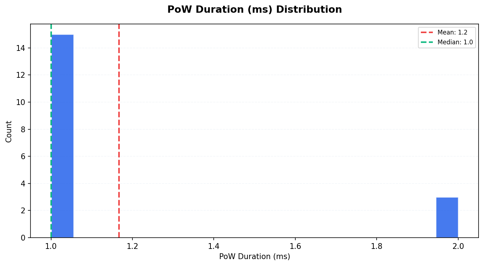
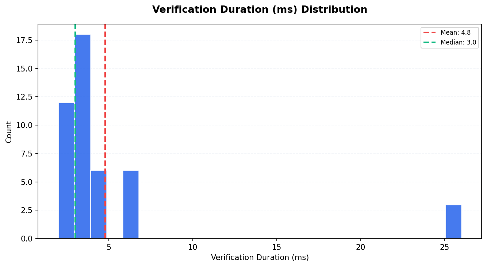
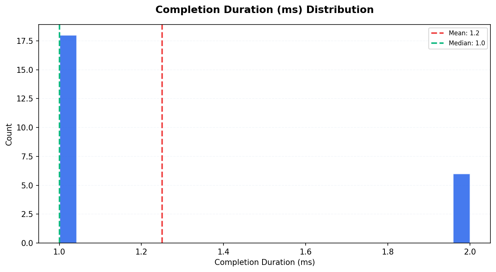
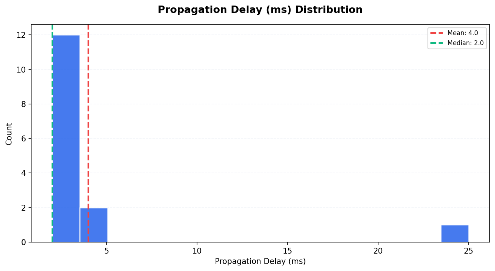
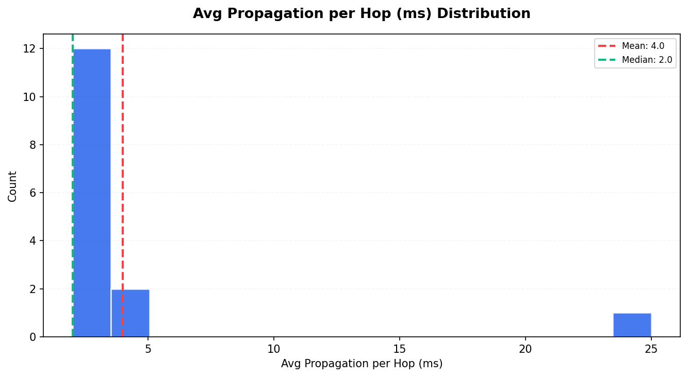
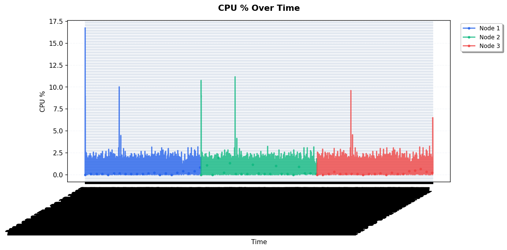
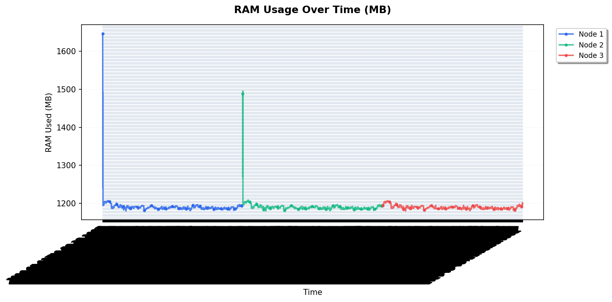

# Tangle Simulation Report — Run 1777841705

*Generated: 2026-05-03T21:31:45.595971*

*Script version: 1.0.0*

---

## Run Summary

| Metric               | Value               |
|:---------------------|:--------------------|
| Run ID               | 1777841705          |
| Status               | complete            |
| Started              | 2026-05-03 20:55:05 |
| Ended                | 2026-05-03 21:31:44 |
| Duration             | 0:36:39             |
| Node Count (params)  | 3                   |
| Tx Count (params)    | 5                   |
| Tx Delay (ms)        | 300                 |
| Max Peers            | 5                   |
| PoW                  | 1                   |
| Wait (ms)            | 600                 |
| Total Nodes (actual) | 3                   |
| Total Transactions   | 48                  |
| Unique Transactions  | 16                  |
| Total Hops           | 78                  |
| Total Peers          | 6                   |
| Metrics Records      | 6345                |

## Node Overview

|   Index | Node ID                 |   Tx Count |   Peer Count |   Has Metrics |
|--------:|:------------------------|-----------:|-------------:|--------------:|
|       1 | rrXlqJR30FJjdDn+GHEJ... |         16 |            2 |             1 |
|       2 | obxq2WbAe+3pAyvM6K8Q... |         16 |            2 |             1 |
|       3 | r9gCQpKLSQJciV+wqTmX... |         16 |            2 |             1 |

## Transaction Timing Statistics

| Metric                       |   Count |   Mean |   Median |   P95 |
|:-----------------------------|--------:|-------:|---------:|------:|
| PoW Duration (ms)            |      18 |   1.17 |        1 |   2   |
| Consensus Duration (ms)      |       0 |   0    |        0 |   0   |
| Verification Duration (ms)   |      45 |   4.8  |        3 |  22   |
| Completion Duration (ms)     |      24 |   1.25 |        1 |   2   |
| Propagation Delay (ms)       |      15 |   4    |        2 |  10.3 |
| Avg Propagation per Hop (ms) |      15 |   4    |        2 |  10.3 |

## Consistency Analysis

| Metric                  | Value   |
|:------------------------|:--------|
| Consistency Score       | 100.00% |
| Fully Replicated Tx     | 16      |
| Partially Replicated Tx | 0       |
| Total Unique Tx         | 16      |
| Parent Conflicts        | 0       |
| Signature Conflicts     | 0       |
| Data Conflicts          | 0       |
| Weight Differences      | 0       |
| Consensus Differences   | 0       |

### Replication Distribution

How many nodes have each transaction:

| Node Count   |   Transactions |
|:-------------|---------------:|
| 3 nodes      |             16 |

## Peer Topology

| Metric                 |   Value |
|:-----------------------|--------:|
| Total Peer Connections |       6 |
| Avg Peers per Node     |       2 |
| Isolated Nodes         |       0 |
| Peers in state 2       |       6 |

## Resource Metrics

Total metric records: 6345

### RAM Statistics per Node

|   Node |   Avg RAM Used (MB) |   Max RAM Used (MB) |   Total RAM (MB) |
|-------:|--------------------:|--------------------:|-----------------:|
|      1 |             1190.52 |                1646 |            15661 |
|      2 |             1190.33 |                1495 |            15661 |
|      3 |             1189.92 |                1207 |            15661 |

## Appendix

| Field           | Value                      |
|:----------------|:---------------------------|
| Generated At    | 2026-05-03T21:33:41.716513 |
| Script Version  | 1.0.0                      |
| Database Path   | /data/db.sqlite3           |
| Run ID          | 1777841705                 |
| Internal Run ID | 26                         |
| Charts Created  | 11                         |

