# Tangle Simulation Report — Run 1777843914

*Generated: 2026-05-03T22:08:50.495857*

*Script version: 1.0.0*

---

## Run Summary

| Metric               | Value               |
|:---------------------|:--------------------|
| Run ID               | 1777843914          |
| Status               | complete            |
| Started              | 2026-05-03 21:31:54 |
| Ended                | 2026-05-03 22:08:49 |
| Duration             | 0:36:55             |
| Node Count (params)  | 4                   |
| Tx Count (params)    | 5                   |
| Tx Delay (ms)        | 300                 |
| Max Peers            | 5                   |
| PoW                  | 1                   |
| Wait (ms)            | 600                 |
| Total Nodes (actual) | 4                   |
| Total Transactions   | 66                  |
| Unique Transactions  | 21                  |
| Total Hops           | 108                 |
| Total Peers          | 12                  |
| Metrics Records      | 8460                |

## Node Overview

|   Index | Node ID                 |   Tx Count |   Peer Count |   Has Metrics |
|--------:|:------------------------|-----------:|-------------:|--------------:|
|       1 | PEopKLqpTFMmPsIYjG/y... |         21 |            3 |             1 |
|       2 | HfJHdMndLHJ14+hJ1kuq... |         21 |            3 |             1 |
|       3 | LX2I6IwpCkYBH5+a4wbQ... |         12 |            3 |             1 |
|       4 | akmM2RyuuQVHtTMavzbd... |         12 |            3 |             1 |

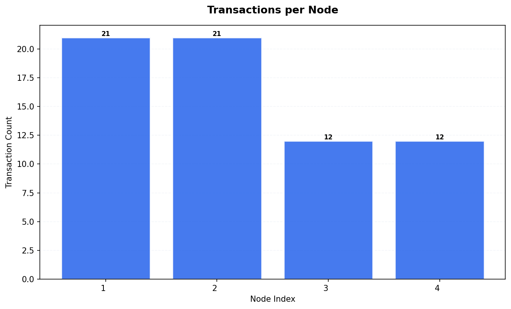

## Transaction Timing Statistics

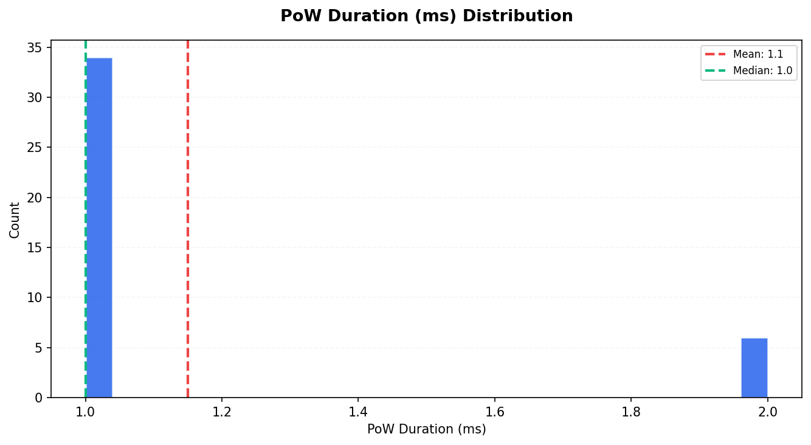

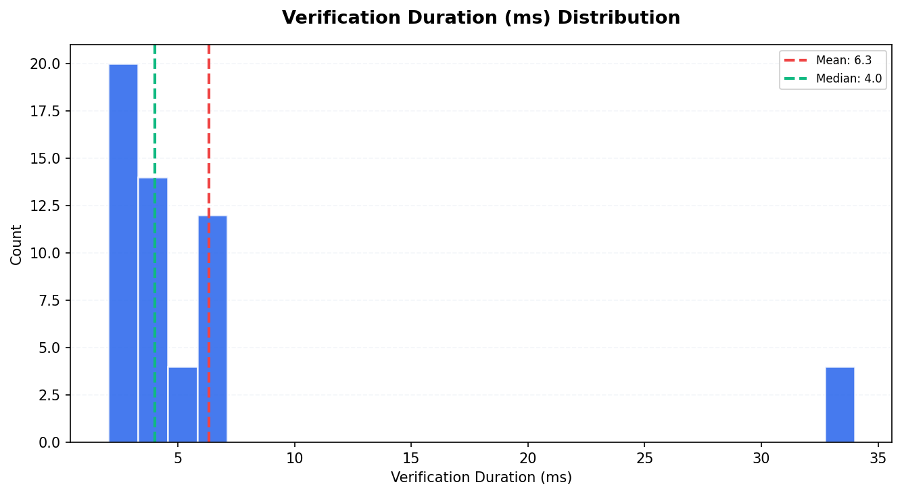

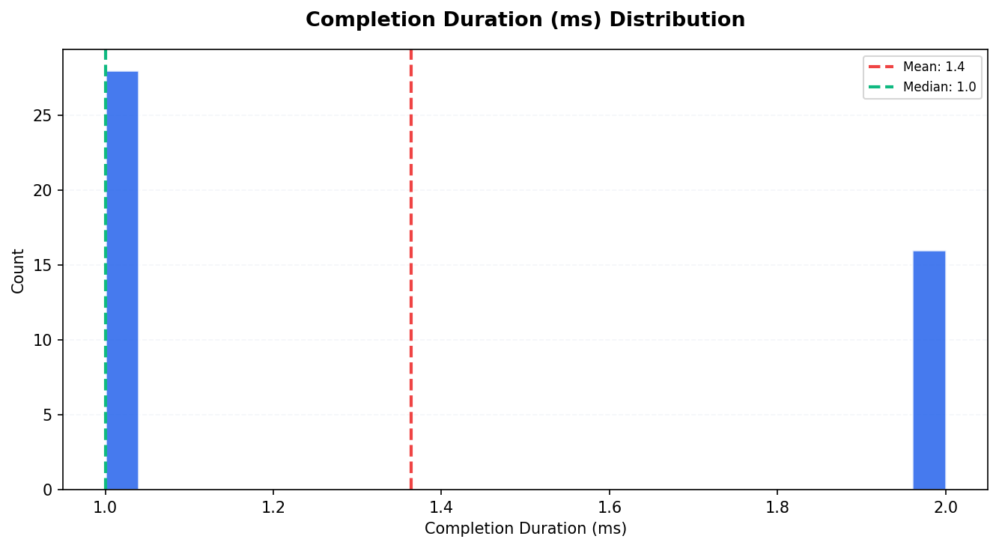

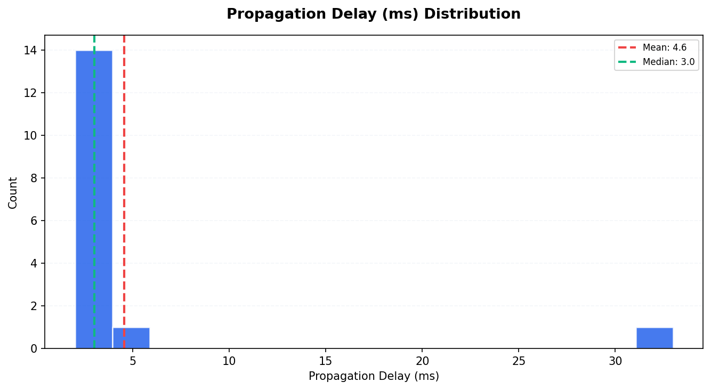

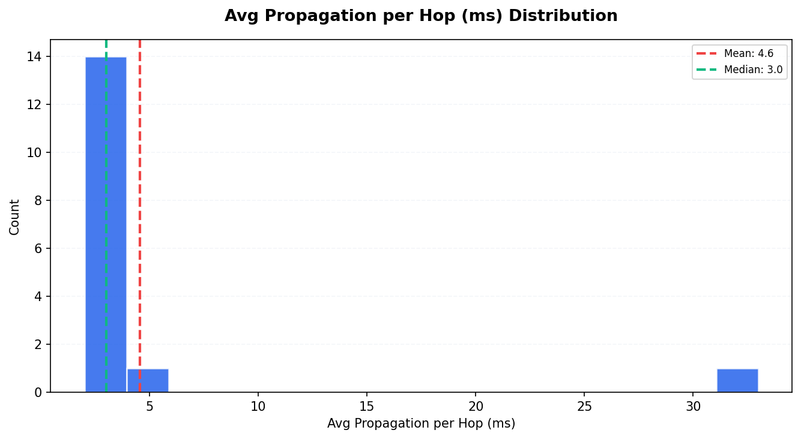

| Metric                       |   Count |   Mean |   Median |   P95 |
|:-----------------------------|--------:|-------:|---------:|------:|
| PoW Duration (ms)            |      40 |   1.15 |        1 |  2    |
| Consensus Duration (ms)      |       0 |   0    |        0 |  0    |
| Verification Duration (ms)   |      54 |   6.33 |        4 | 34    |
| Completion Duration (ms)     |      44 |   1.36 |        1 |  2    |
| Propagation Delay (ms)       |      16 |   4.56 |        3 | 11.25 |
| Avg Propagation per Hop (ms) |      16 |   4.56 |        3 | 11.25 |

## Consistency Analysis

| Metric                  | Value   |
|:------------------------|:--------|
| Consistency Score       | 57.14%  |
| Fully Replicated Tx     | 12      |
| Partially Replicated Tx | 9       |
| Total Unique Tx         | 21      |
| Parent Conflicts        | 0       |
| Signature Conflicts     | 0       |
| Data Conflicts          | 0       |
| Weight Differences      | 3       |
| Consensus Differences   | 0       |

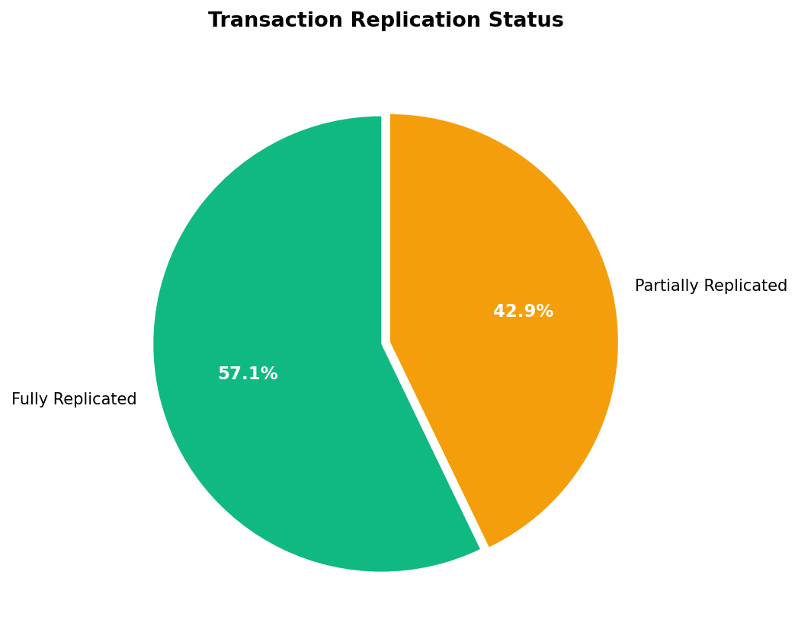

### Replication Distribution

How many nodes have each transaction:

| Node Count   |   Transactions |
|:-------------|---------------:|
| 2 nodes      |              9 |
| 4 nodes      |             12 |

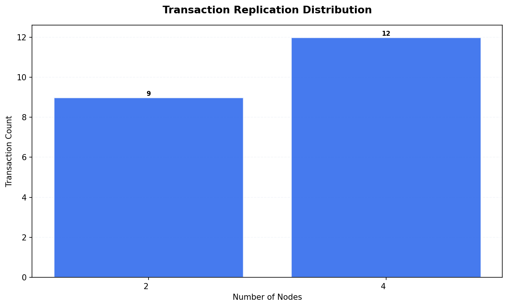

## Peer Topology

| Metric                 |   Value |
|:-----------------------|--------:|
| Total Peer Connections |      12 |
| Avg Peers per Node     |       3 |
| Isolated Nodes         |       0 |
| Peers in state 2       |      12 |

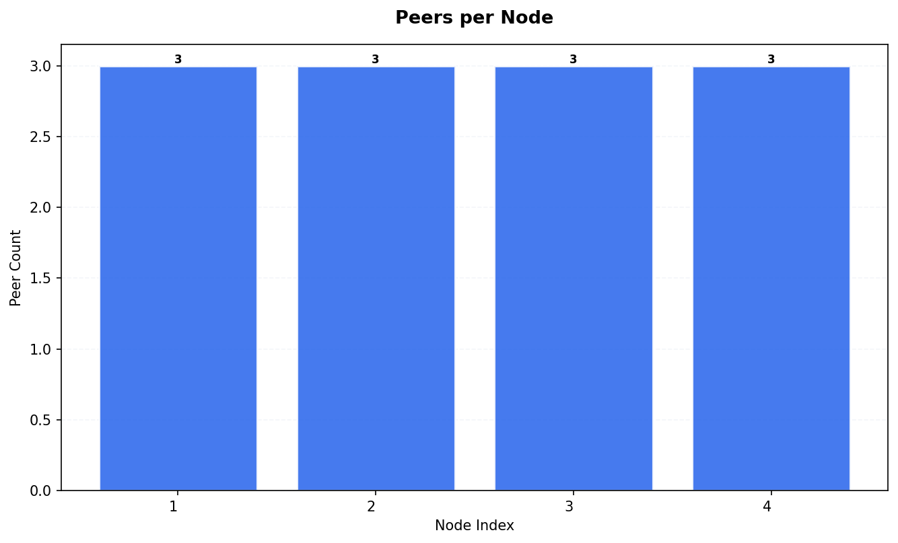

## Resource Metrics

Total metric records: 8460

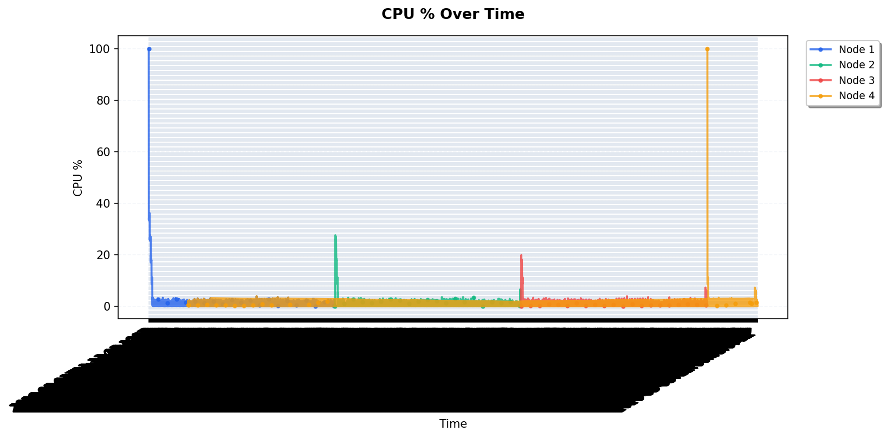

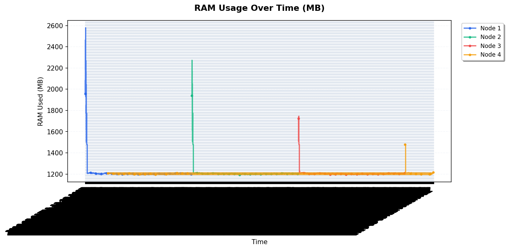

### RAM Statistics per Node

|   Node |   Avg RAM Used (MB) |   Max RAM Used (MB) |   Total RAM (MB) |
|-------:|--------------------:|--------------------:|-----------------:|
|      1 |             1215.93 |                2579 |            15661 |
|      2 |             1211.12 |                2273 |            15661 |
|      3 |             1206.59 |                1746 |            15661 |
|      4 |             1204.97 |                1479 |            15661 |

## Appendix

| Field           | Value                      |
|:----------------|:---------------------------|
| Generated At    | 2026-05-03T22:11:03.299636 |
| Script Version  | 1.0.0                      |
| Database Path   | /data/db.sqlite3           |
| Run ID          | 1777843914                 |
| Internal Run ID | 27                         |
| Charts Created  | 11                         |

