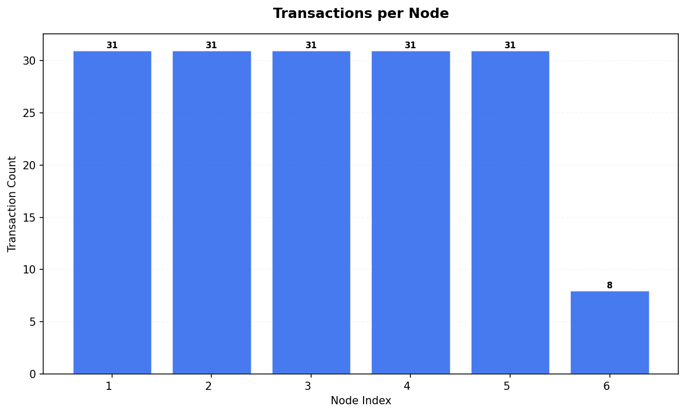
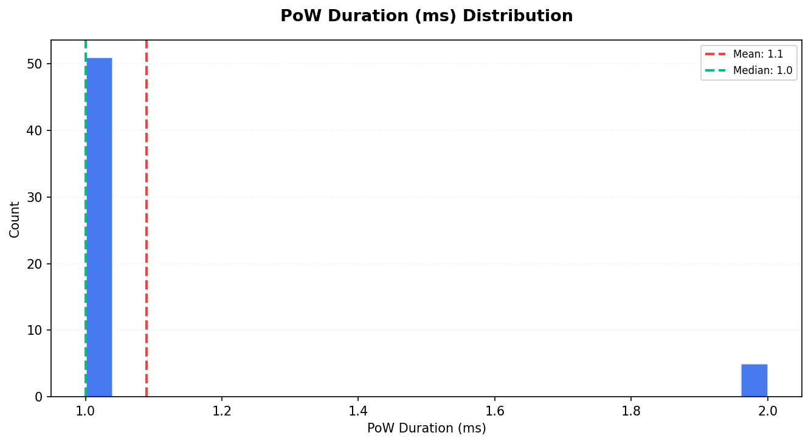
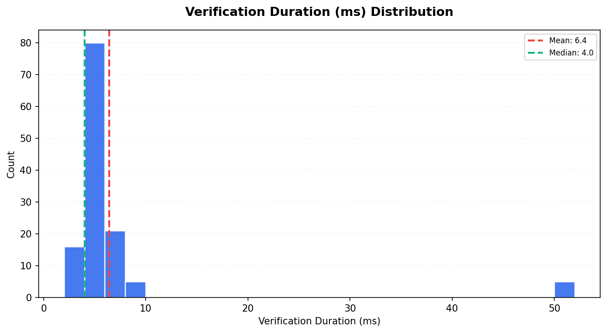
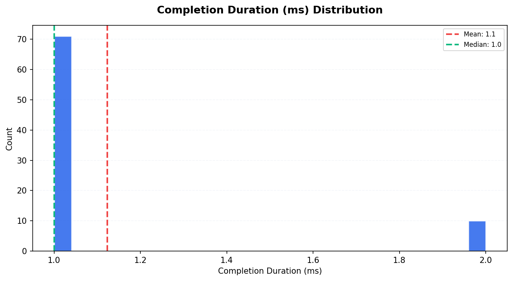
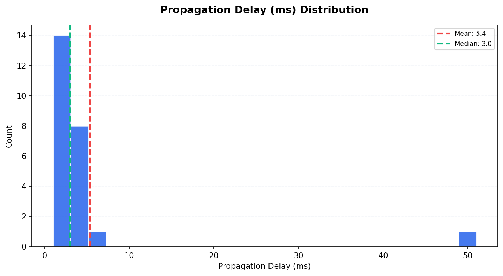
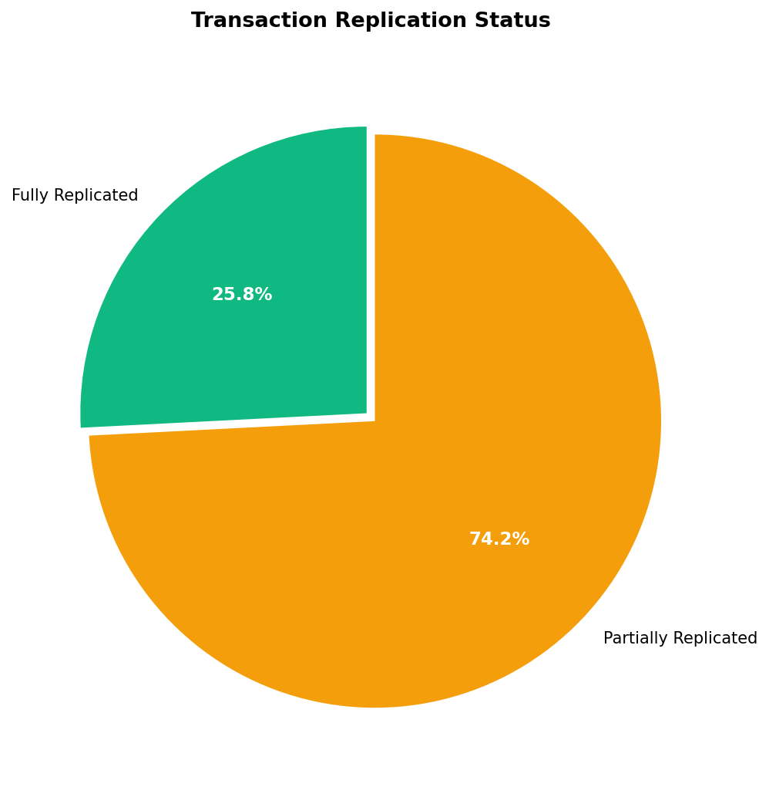
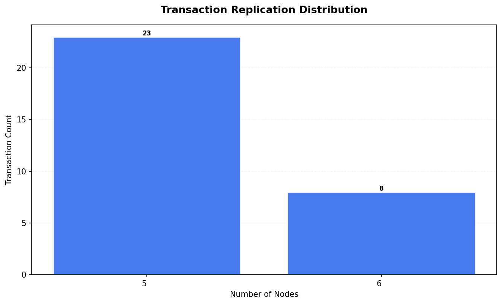
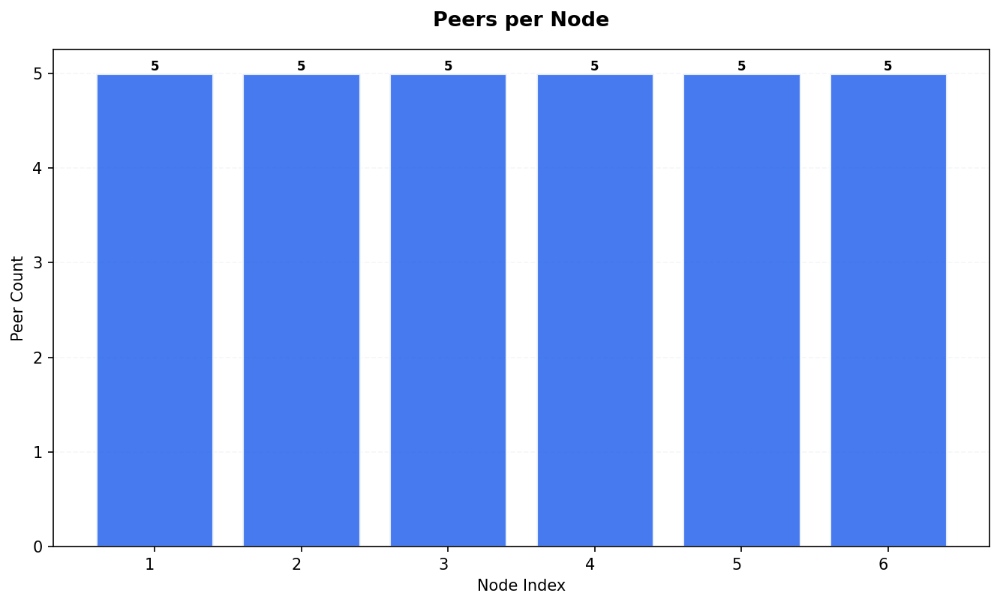
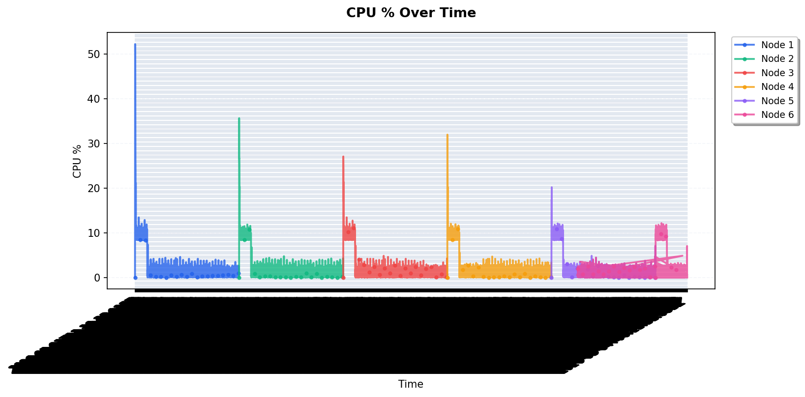
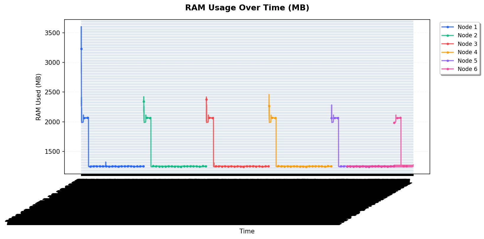

# Tangle Simulation Report — Run 1777851376

*Generated: 2026-05-04T00:14:00.916656*

*Script version: 1.0.0*

---

## Run Summary

| Metric               | Value               |
|:---------------------|:--------------------|
| Run ID               | 1777851376          |
| Status               | complete            |
| Started              | 2026-05-03 23:36:16 |
| Ended                | 2026-05-04 00:13:59 |
| Duration             | 0:37:43             |
| Node Count (params)  | 6                   |
| Tx Count (params)    | 5                   |
| Tx Delay (ms)        | 300                 |
| Max Peers            | 5                   |
| PoW                  | 1                   |
| Wait (ms)            | 600                 |
| Total Nodes (actual) | 6                   |
| Total Transactions   | 163                 |
| Unique Transactions  | 31                  |
| Total Hops           | 291                 |
| Total Peers          | 30                  |
| Metrics Records      | 12690               |

## Node Overview

|   Index | Node ID                 |   Tx Count |   Peer Count |   Has Metrics |
|--------:|:------------------------|-----------:|-------------:|--------------:|
|       1 | k1w99JvQ2lN/Ft7szrl6... |         31 |            5 |             1 |
|       2 | iKuDx7dM9jvsSv3JPJ2d... |         31 |            5 |             1 |
|       3 | +P/hMhWsxGIO+Cbp+9Ul... |         31 |            5 |             1 |
|       4 | /IOg8GYmzHOmAe7w1QaI... |         31 |            5 |             1 |
|       5 | JURjpYiBndLgGVSI5uR7... |         31 |            5 |             1 |
|       6 | eJsx70l/zVZLKIbXEVI+... |          8 |            5 |             1 |

## Transaction Timing Statistics

| Metric                       |   Count |   Mean |   Median |   P95 |
|:-----------------------------|--------:|-------:|---------:|------:|
| PoW Duration (ms)            |      56 |   1.09 |        1 |  2    |
| Consensus Duration (ms)      |       0 |   0    |        0 |  0    |
| Verification Duration (ms)   |     127 |   6.43 |        4 |  8    |
| Completion Duration (ms)     |      81 |   1.12 |        1 |  2    |
| Propagation Delay (ms)       |      24 |   5.38 |        3 |  5.85 |
| Avg Propagation per Hop (ms) |      24 |   5.38 |        3 |  5.85 |

## Consistency Analysis

| Metric                  | Value   |
|:------------------------|:--------|
| Consistency Score       | 25.81%  |
| Fully Replicated Tx     | 8       |
| Partially Replicated Tx | 23      |
| Total Unique Tx         | 31      |
| Parent Conflicts        | 0       |
| Signature Conflicts     | 0       |
| Data Conflicts          | 0       |
| Weight Differences      | 3       |
| Consensus Differences   | 0       |

### Replication Distribution

How many nodes have each transaction:

| Node Count   |   Transactions |
|:-------------|---------------:|
| 5 nodes      |             23 |
| 6 nodes      |              8 |

## Peer Topology

| Metric                 |   Value |
|:-----------------------|--------:|
| Total Peer Connections |      30 |
| Avg Peers per Node     |       5 |
| Isolated Nodes         |       0 |
| Peers in state 2       |      30 |

## Resource Metrics

Total metric records: 12690

### RAM Statistics per Node

|   Node |   Avg RAM Used (MB) |   Max RAM Used (MB) |   Total RAM (MB) |
|-------:|--------------------:|--------------------:|-----------------:|
|      1 |             1344.9  |                3605 |            15661 |
|      2 |             1339.46 |                2423 |            15661 |
|      3 |             1339.1  |                2418 |            15661 |
|      4 |             1339.55 |                2459 |            15661 |
|      5 |             1336.87 |                2284 |            15661 |
|      6 |             1334.24 |                2114 |            15661 |

## Appendix

| Field           | Value                      |
|:----------------|:---------------------------|
| Generated At    | 2026-05-04T00:17:30.354655 |
| Script Version  | 1.0.0                      |
| Database Path   | /data/db.sqlite3           |
| Run ID          | 1777851376                 |
| Internal Run ID | 29                         |
| Charts Created  | 11                         |

