# Tangle Simulation Report — Run 1777853649

*Generated: 2026-05-04T00:51:39.150580*

*Script version: 1.0.0*

---

## Run Summary

| Metric               | Value               |
|:---------------------|:--------------------|
| Run ID               | 1777853649          |
| Status               | complete            |
| Started              | 2026-05-04 00:14:09 |
| Ended                | 2026-05-04 00:51:37 |
| Duration             | 0:37:28             |
| Node Count (params)  | 7                   |
| Tx Count (params)    | 5                   |
| Tx Delay (ms)        | 300                 |
| Max Peers            | 5                   |
| PoW                  | 1                   |
| Wait (ms)            | 600                 |
| Total Nodes (actual) | 7                   |
| Total Transactions   | 228                 |
| Unique Transactions  | 36                  |
| Total Hops           | 448                 |
| Total Peers          | 42                  |
| Metrics Records      | 14805               |

## Node Overview

|   Index | Node ID                 |   Tx Count |   Peer Count |   Has Metrics |
|--------:|:------------------------|-----------:|-------------:|--------------:|
|       1 | 4Zt5wc4BMUqVHKB2M0u1... |         36 |            6 |             1 |
|       2 | uP9pjtV4Rj71QakMy4PI... |         36 |            6 |             1 |
|       3 | wd7GNLskBO7ClU+2MB3B... |         36 |            6 |             1 |
|       4 | 7/yepdNk6uDSzI9+OhpL... |         30 |            6 |             1 |
|       5 | 8Bih2ymCanvhuxL9QZOL... |         30 |            6 |             1 |
|       6 | T6yo9isSDuOFwcgeXUQq... |         30 |            6 |             1 |
|       7 | IDgxwEDVaA9ZuWJjH1kt... |         30 |            6 |             1 |

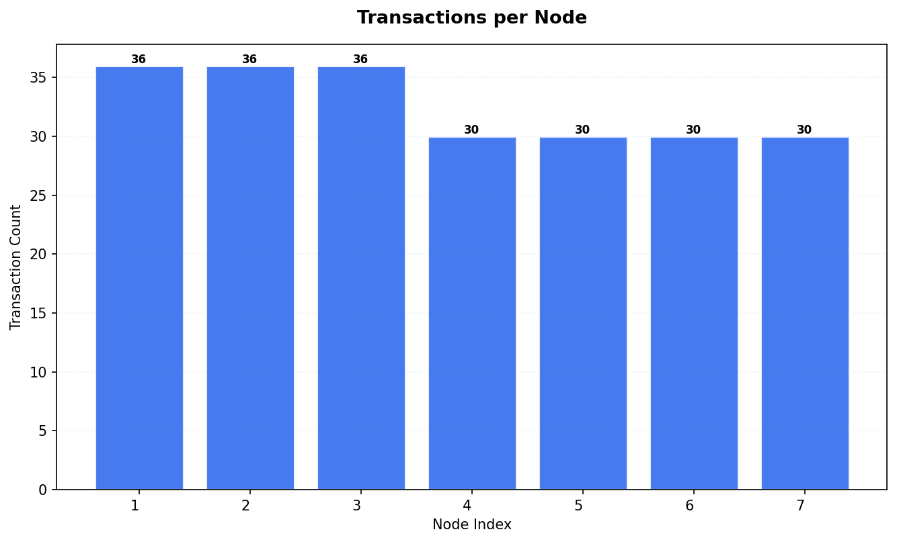

## Transaction Timing Statistics

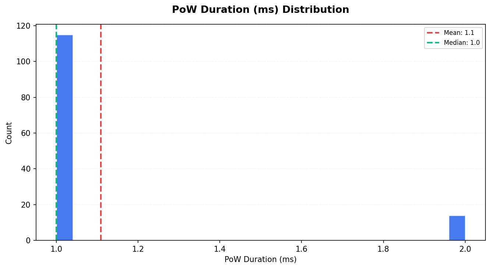

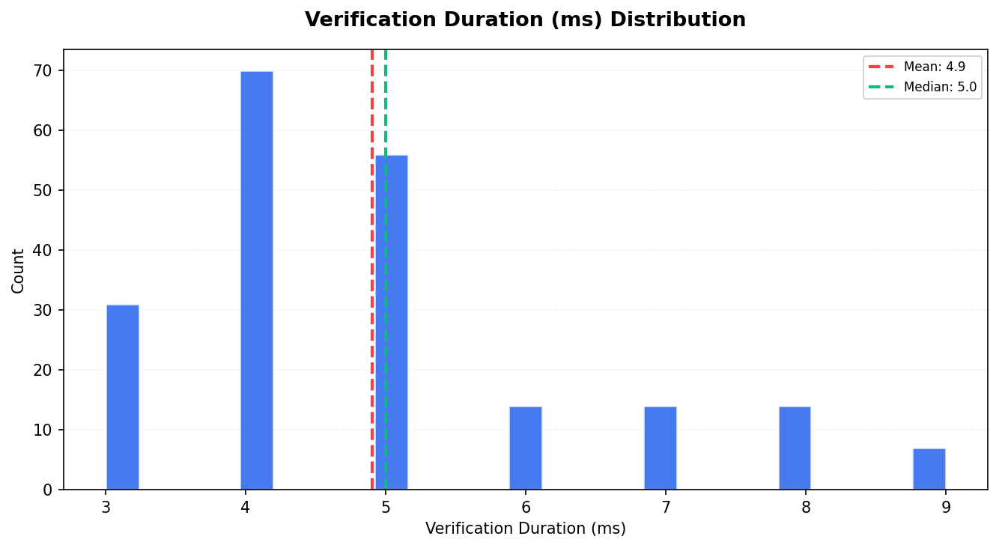

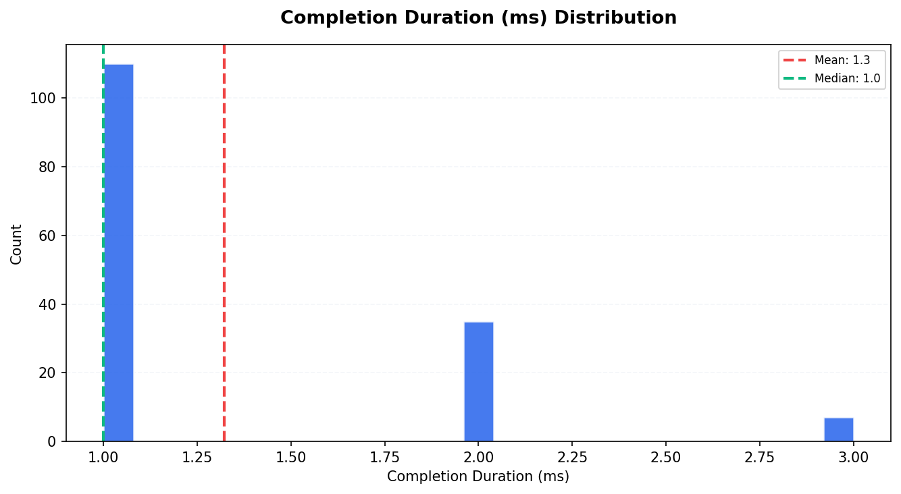

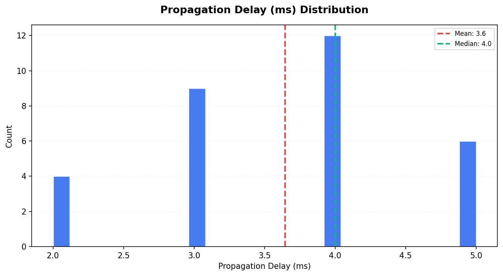

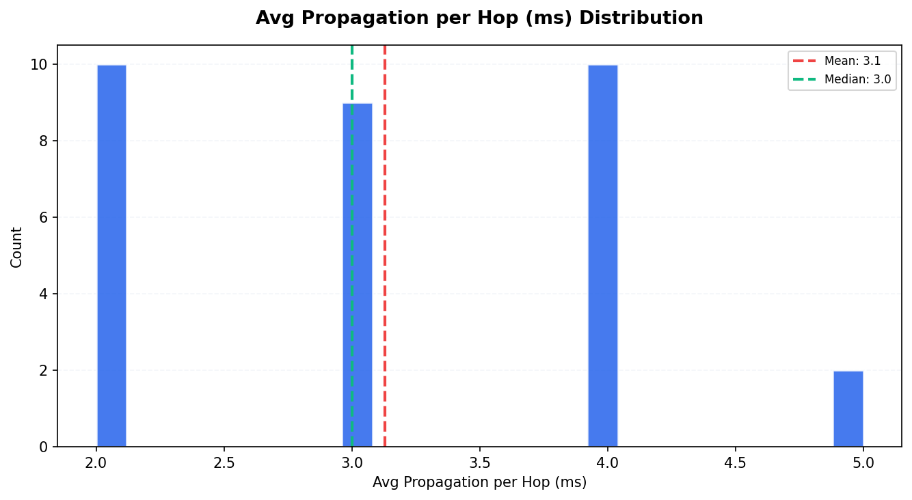

| Metric                       |   Count |   Mean |   Median |   P95 |
|:-----------------------------|--------:|-------:|---------:|------:|
| PoW Duration (ms)            |     129 |   1.11 |        1 |   2   |
| Consensus Duration (ms)      |       0 |   0    |        0 |   0   |
| Verification Duration (ms)   |     206 |   4.9  |        5 |   8   |
| Completion Duration (ms)     |     152 |   1.32 |        1 |   2   |
| Propagation Delay (ms)       |      31 |   3.65 |        4 |   5   |
| Avg Propagation per Hop (ms) |      31 |   3.13 |        3 |   4.5 |

## Consistency Analysis

| Metric                  | Value   |
|:------------------------|:--------|
| Consistency Score       | 83.33%  |
| Fully Replicated Tx     | 30      |
| Partially Replicated Tx | 6       |
| Total Unique Tx         | 36      |
| Parent Conflicts        | 0       |
| Signature Conflicts     | 0       |
| Data Conflicts          | 0       |
| Weight Differences      | 6       |
| Consensus Differences   | 0       |

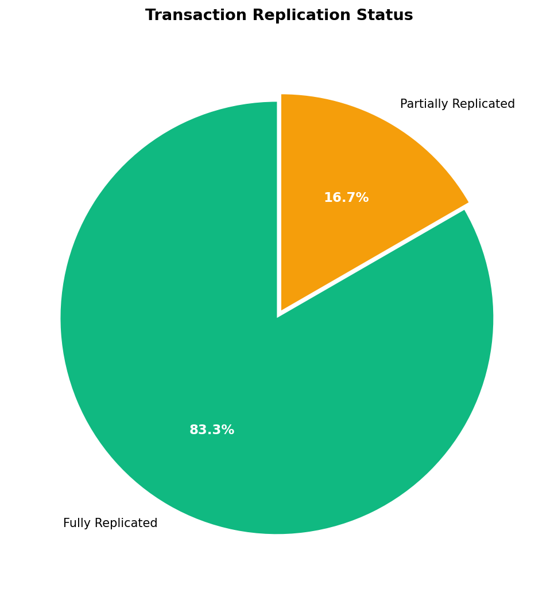

### Replication Distribution

How many nodes have each transaction:

| Node Count   |   Transactions |
|:-------------|---------------:|
| 3 nodes      |              6 |
| 7 nodes      |             30 |

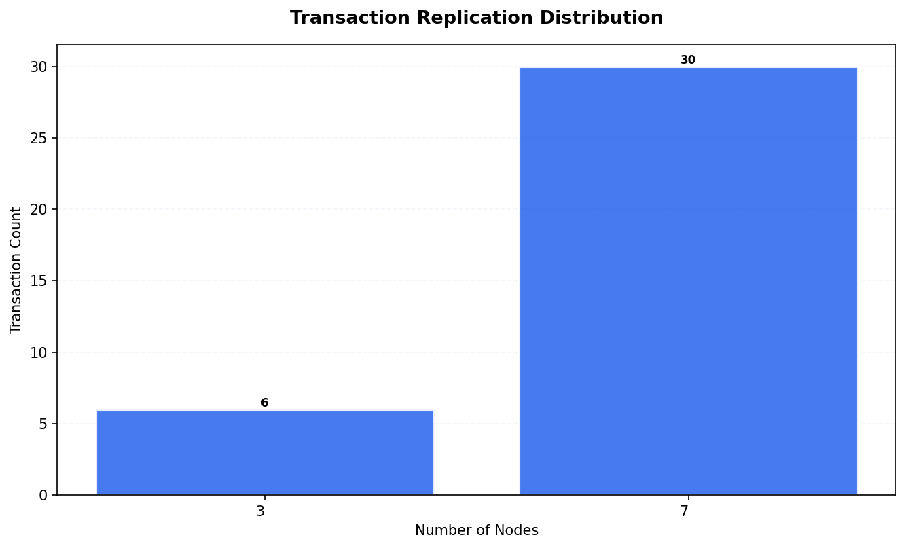

## Peer Topology

| Metric                 |   Value |
|:-----------------------|--------:|
| Total Peer Connections |      42 |
| Avg Peers per Node     |       6 |
| Isolated Nodes         |       0 |
| Peers in state 2       |      42 |

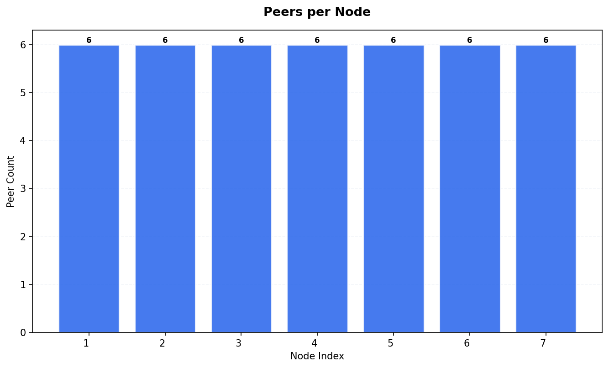

## Resource Metrics

Total metric records: 14805

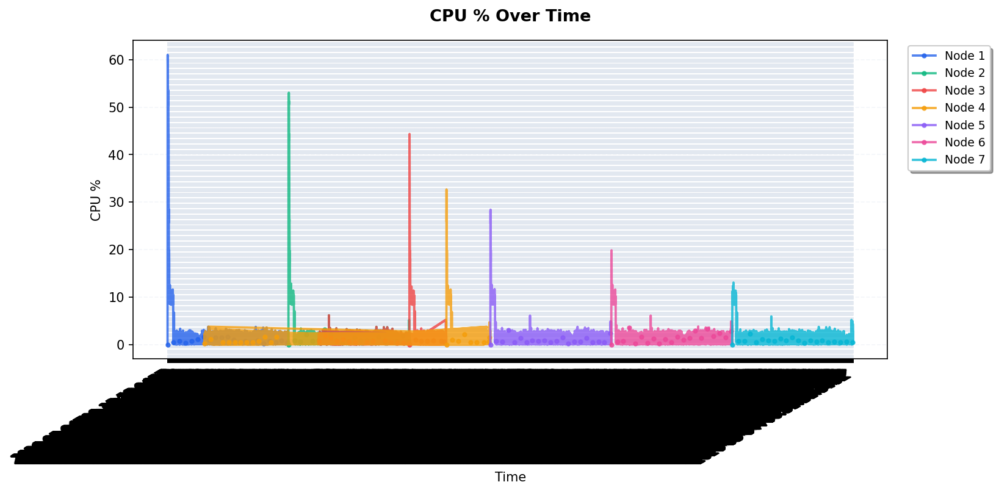

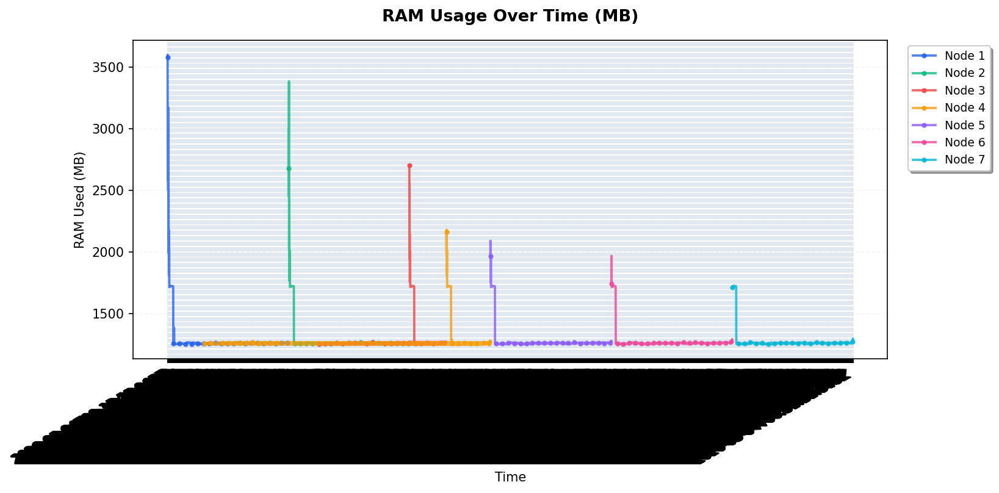

### RAM Statistics per Node

|   Node |   Avg RAM Used (MB) |   Max RAM Used (MB) |   Total RAM (MB) |
|-------:|--------------------:|--------------------:|-----------------:|
|      1 |             1293.53 |                3600 |            15661 |
|      2 |             1288.79 |                3385 |            15661 |
|      3 |             1281.49 |                2703 |            15661 |
|      4 |             1279.45 |                2181 |            15661 |
|      5 |             1278.91 |                2092 |            15661 |
|      6 |             1277.67 |                1968 |            15661 |
|      7 |             1275.9  |                1726 |            15661 |

## Appendix

| Field           | Value                      |
|:----------------|:---------------------------|
| Generated At    | 2026-05-04T00:55:29.601442 |
| Script Version  | 1.0.0                      |
| Database Path   | /data/db.sqlite3           |
| Run ID          | 1777853649                 |
| Internal Run ID | 30                         |
| Charts Created  | 11                         |

