# Tangle Simulation Report — Run 1777855907

*Generated: 2026-05-04T01:29:30.782142*

*Script version: 1.0.0*

---

## Run Summary

| Metric               | Value               |
|:---------------------|:--------------------|
| Run ID               | 1777855907          |
| Status               | complete            |
| Started              | 2026-05-04 00:51:47 |
| Ended                | 2026-05-04 01:29:29 |
| Duration             | 0:37:42             |
| Node Count (params)  | 8                   |
| Tx Count (params)    | 5                   |
| Tx Delay (ms)        | 300                 |
| Max Peers            | 5                   |
| PoW                  | 1                   |
| Wait (ms)            | 600                 |
| Total Nodes (actual) | 8                   |
| Total Transactions   | 286                 |
| Unique Transactions  | 41                  |
| Total Hops           | 595                 |
| Total Peers          | 56                  |
| Metrics Records      | 16920               |

## Node Overview

|   Index | Node ID                 |   Tx Count |   Peer Count |   Has Metrics |
|--------:|:------------------------|-----------:|-------------:|--------------:|
|       1 | 6VHi0G66nOeRDysOYVZI... |         41 |            7 |             1 |
|       2 | K6UQscbQQ7PKhys9sVG6... |         41 |            7 |             1 |
|       3 | AyQR1DI3Jz06gu6MLclz... |         41 |            7 |             1 |
|       4 | FXP9sxNe+ZpYylr28ET7... |         41 |            7 |             1 |
|       5 | 6i3ut1+E+BKIJcsLCkZ0... |         41 |            7 |             1 |
|       6 | N+AGKJawRH2i/wHS5KF1... |         27 |            7 |             1 |
|       7 | rzdfnvjb7tQil3xvGWJu... |         27 |            7 |             1 |
|       8 | ZrT4E+N37MRf1+K4q/01... |         27 |            7 |             1 |

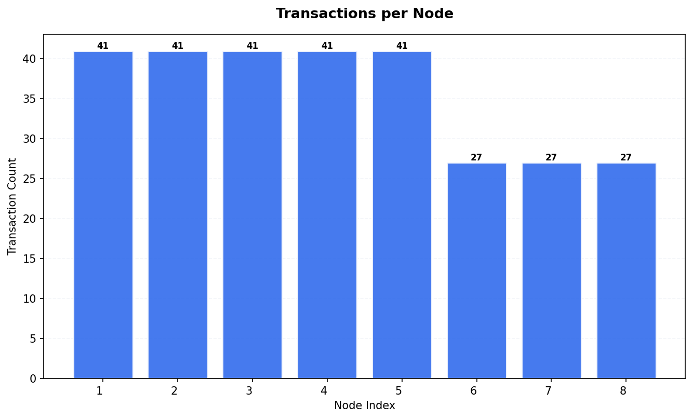

## Transaction Timing Statistics

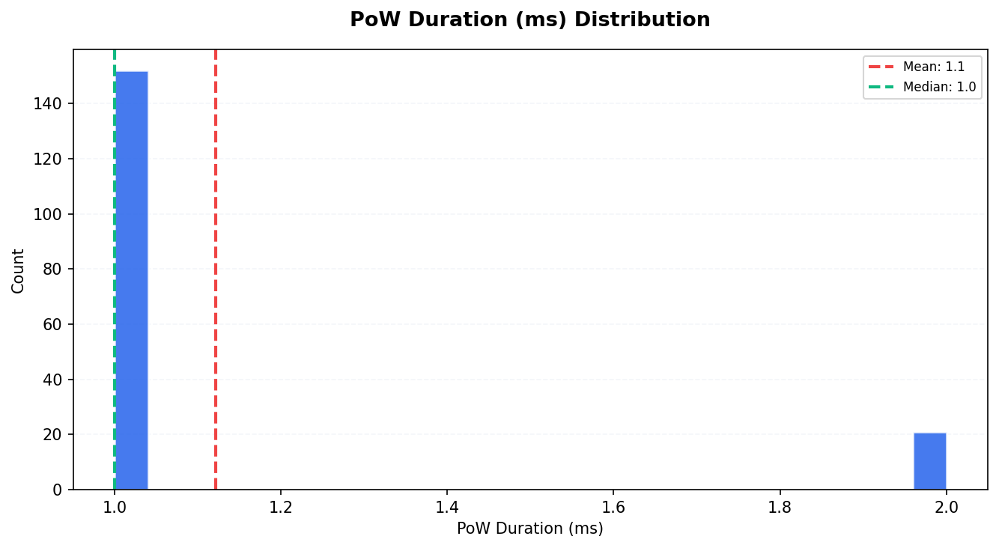

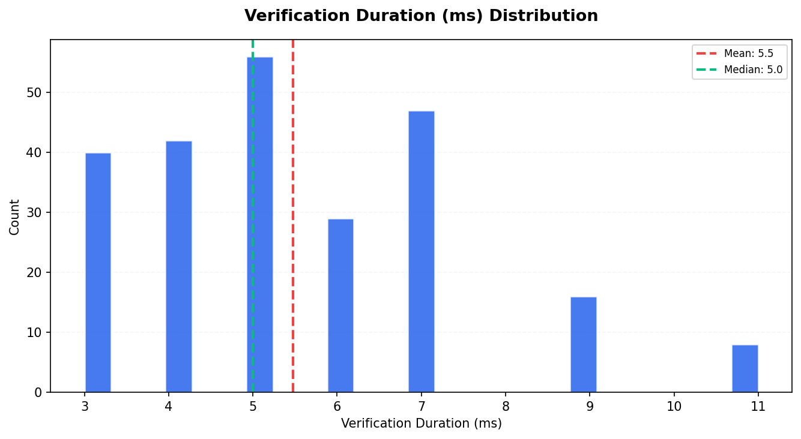

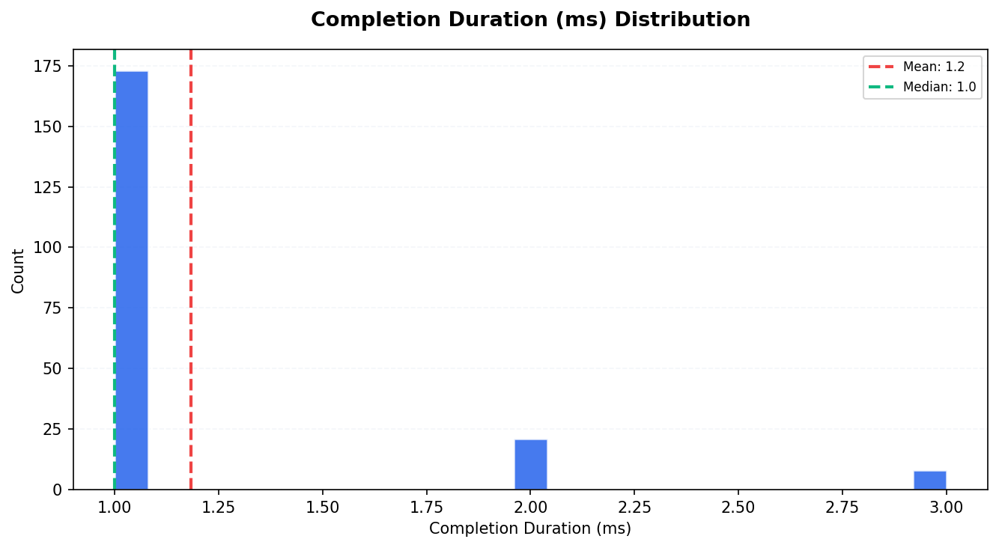

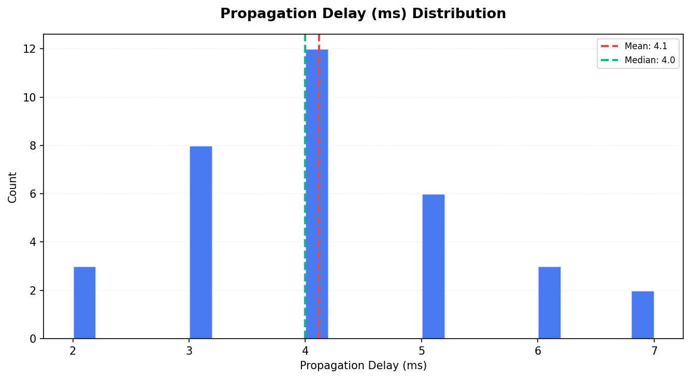

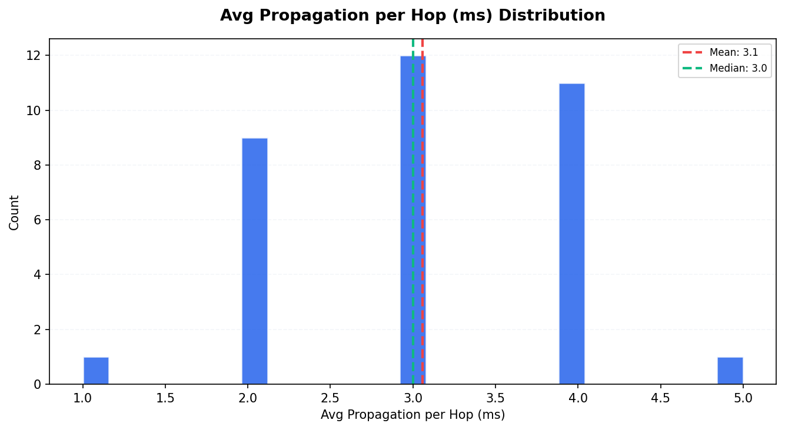

| Metric                       |   Count |   Mean |   Median |   P95 |
|:-----------------------------|--------:|-------:|---------:|------:|
| PoW Duration (ms)            |     173 |   1.12 |        1 |  2    |
| Consensus Duration (ms)      |       0 |   0    |        0 |  0    |
| Verification Duration (ms)   |     238 |   5.47 |        5 |  9    |
| Completion Duration (ms)     |     202 |   1.18 |        1 |  2    |
| Propagation Delay (ms)       |      34 |   4.12 |        4 |  6.35 |
| Avg Propagation per Hop (ms) |      34 |   3.06 |        3 |  4    |

## Consistency Analysis

| Metric                  | Value   |
|:------------------------|:--------|
| Consistency Score       | 65.85%  |
| Fully Replicated Tx     | 27      |
| Partially Replicated Tx | 14      |
| Total Unique Tx         | 41      |
| Parent Conflicts        | 0       |
| Signature Conflicts     | 0       |
| Data Conflicts          | 0       |
| Weight Differences      | 14      |
| Consensus Differences   | 0       |

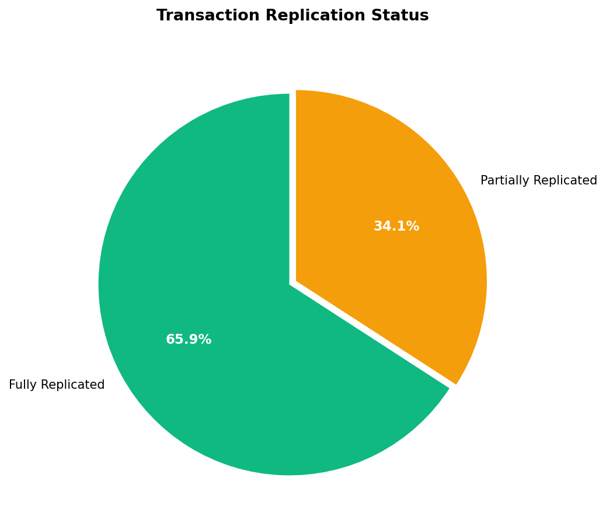

### Replication Distribution

How many nodes have each transaction:

| Node Count   |   Transactions |
|:-------------|---------------:|
| 5 nodes      |             14 |
| 8 nodes      |             27 |

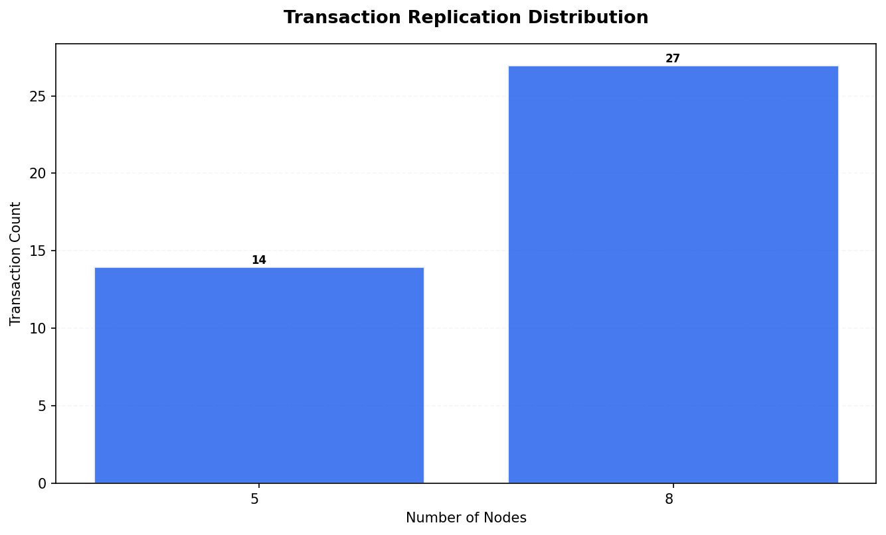

## Peer Topology

| Metric                 |   Value |
|:-----------------------|--------:|
| Total Peer Connections |      56 |
| Avg Peers per Node     |       7 |
| Isolated Nodes         |       0 |
| Peers in state 2       |      56 |

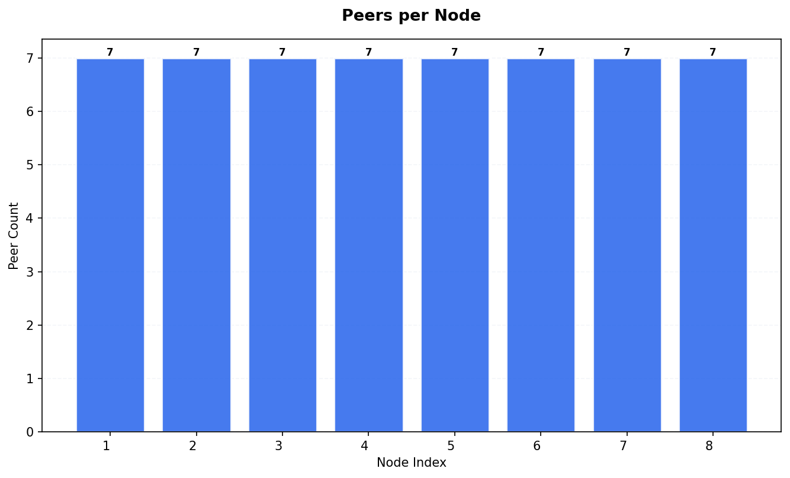

## Resource Metrics

Total metric records: 16920

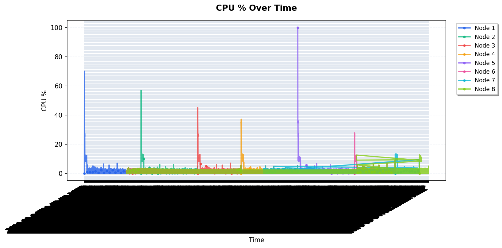

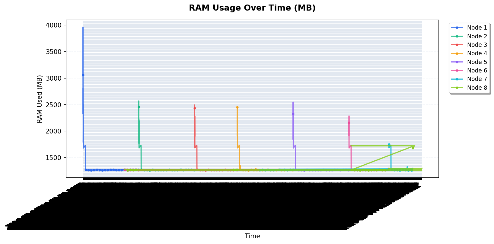

### RAM Statistics per Node

|   Node |   Avg RAM Used (MB) |   Max RAM Used (MB) |   Total RAM (MB) |
|-------:|--------------------:|--------------------:|-----------------:|
|      1 |             1298.23 |                3960 |            15661 |
|      2 |             1290.93 |                2570 |            15661 |
|      3 |             1290.67 |                2494 |            15661 |
|      4 |             1290.35 |                2453 |            15661 |
|      5 |             1290.46 |                2547 |            15661 |
|      6 |             1288.22 |                2287 |            15661 |
|      7 |             1286.41 |                1752 |            15661 |
|      8 |             1286.34 |                1728 |            15661 |

## Appendix

| Field           | Value                      |
|:----------------|:---------------------------|
| Generated At    | 2026-05-04T01:33:41.356228 |
| Script Version  | 1.0.0                      |
| Database Path   | /data/db.sqlite3           |
| Run ID          | 1777855907                 |
| Internal Run ID | 31                         |
| Charts Created  | 11                         |

