# Tangle Simulation Report — Run 1777858179

*Generated: 2026-05-04T02:07:33.131785*

*Script version: 1.0.0*

---

## Run Summary

| Metric               | Value               |
|:---------------------|:--------------------|
| Run ID               | 1777858179          |
| Status               | complete            |
| Started              | 2026-05-04 01:29:39 |
| Ended                | 2026-05-04 02:07:31 |
| Duration             | 0:37:52             |
| Node Count (params)  | 9                   |
| Tx Count (params)    | 5                   |
| Tx Delay (ms)        | 300                 |
| Max Peers            | 5                   |
| PoW                  | 1                   |
| Wait (ms)            | 600                 |
| Total Nodes (actual) | 9                   |
| Total Transactions   | 400                 |
| Unique Transactions  | 46                  |
| Total Hops           | 894                 |
| Total Peers          | 72                  |
| Metrics Records      | 19035               |

## Node Overview

|   Index | Node ID                 |   Tx Count |   Peer Count |   Has Metrics |
|--------:|:------------------------|-----------:|-------------:|--------------:|
|       1 | 9/vAJhWgErReB5ZHuHxr... |         46 |            8 |             1 |
|       2 | 0eoJ1XpXEjJl0WG8bico... |         46 |            8 |             1 |
|       3 | JRn09Xj4bo5gYBi/01EI... |         44 |            8 |             1 |
|       4 | 2l6vNubSc8dmvDjDzrOR... |         44 |            8 |             1 |
|       5 | qZfluzRb77b2vRNd2wFz... |         44 |            8 |             1 |
|       6 | 4tsMPfsZCopkbmb/Z1co... |         44 |            8 |             1 |
|       7 | xAiq//hEIc1NBpjfjhmR... |         44 |            8 |             1 |
|       8 | sVOO5HWX+NZ6I8aMa5HT... |         44 |            8 |             1 |
|       9 | yhJRJ2oZdDW6kWFaBdMi... |         44 |            8 |             1 |

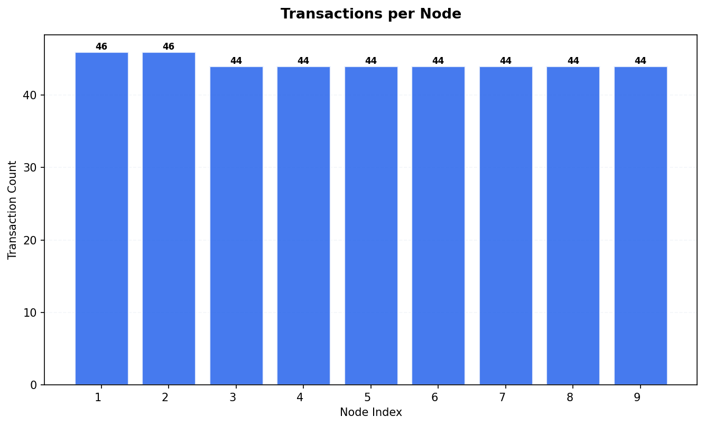

## Transaction Timing Statistics

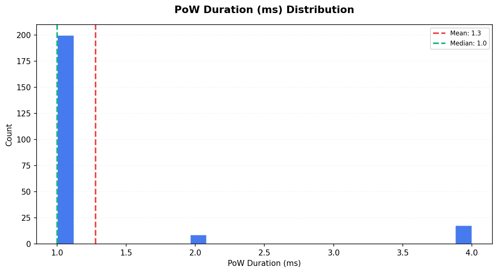

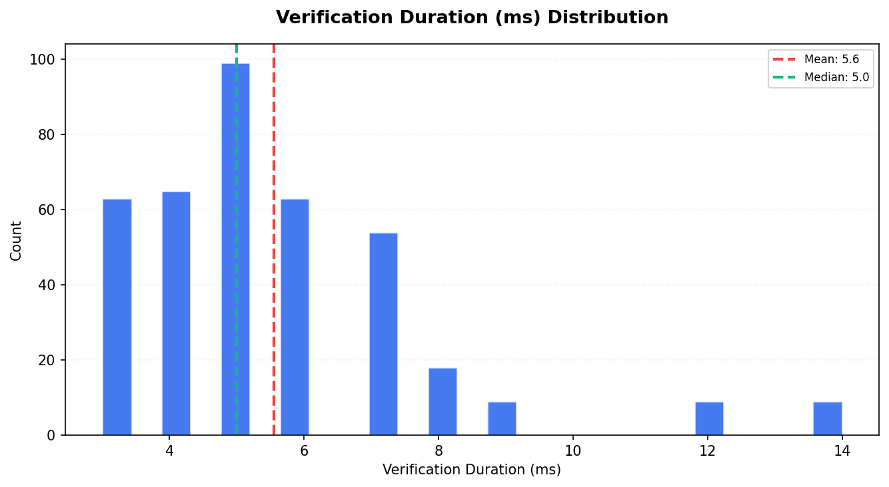

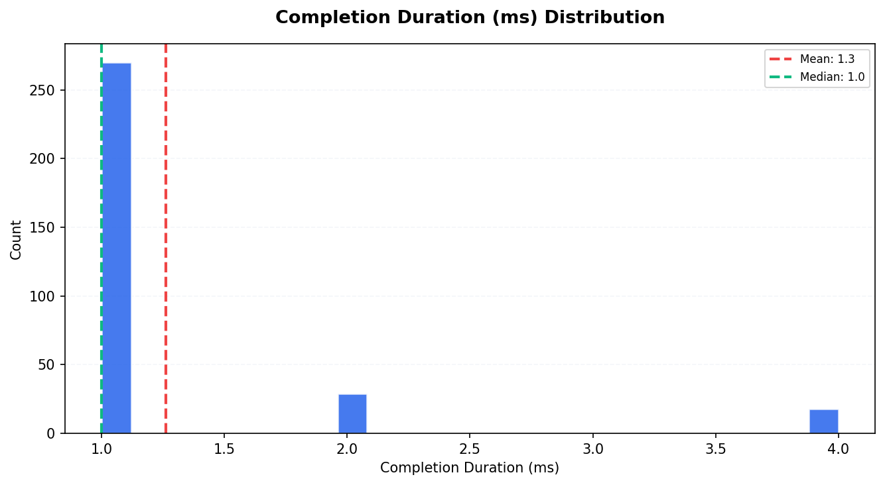

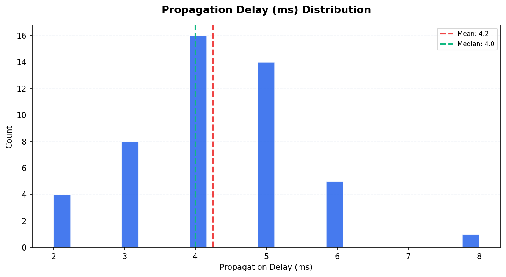

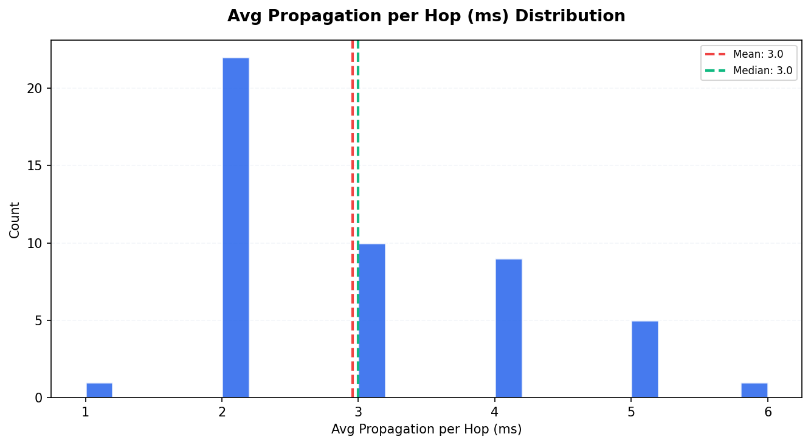

| Metric                       |   Count |   Mean |   Median |   P95 |
|:-----------------------------|--------:|-------:|---------:|------:|
| PoW Duration (ms)            |     227 |   1.28 |        1 |     4 |
| Consensus Duration (ms)      |       0 |   0    |        0 |     0 |
| Verification Duration (ms)   |     389 |   5.55 |        5 |     9 |
| Completion Duration (ms)     |     317 |   1.26 |        1 |     4 |
| Propagation Delay (ms)       |      48 |   4.25 |        4 |     6 |
| Avg Propagation per Hop (ms) |      48 |   2.96 |        3 |     5 |

## Consistency Analysis

| Metric                  | Value   |
|:------------------------|:--------|
| Consistency Score       | 95.65%  |
| Fully Replicated Tx     | 44      |
| Partially Replicated Tx | 2       |
| Total Unique Tx         | 46      |
| Parent Conflicts        | 0       |
| Signature Conflicts     | 0       |
| Data Conflicts          | 0       |
| Weight Differences      | 18      |
| Consensus Differences   | 0       |

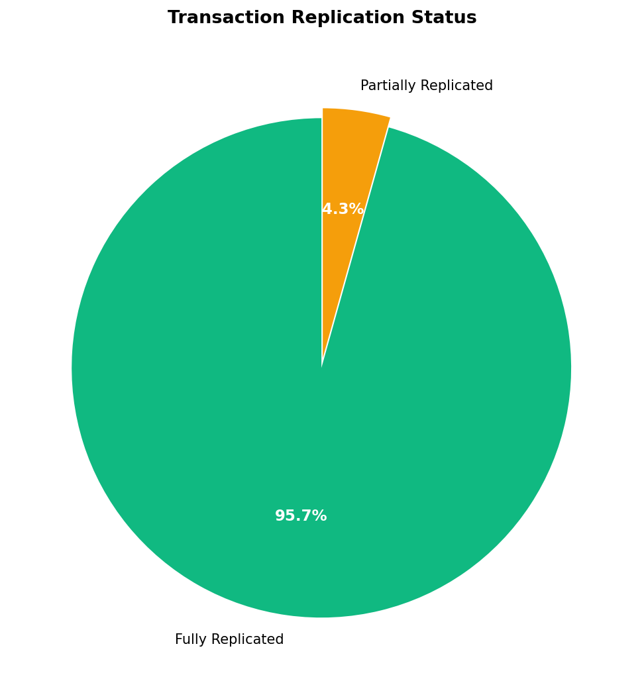

### Replication Distribution

How many nodes have each transaction:

| Node Count   |   Transactions |
|:-------------|---------------:|
| 2 nodes      |              2 |
| 9 nodes      |             44 |

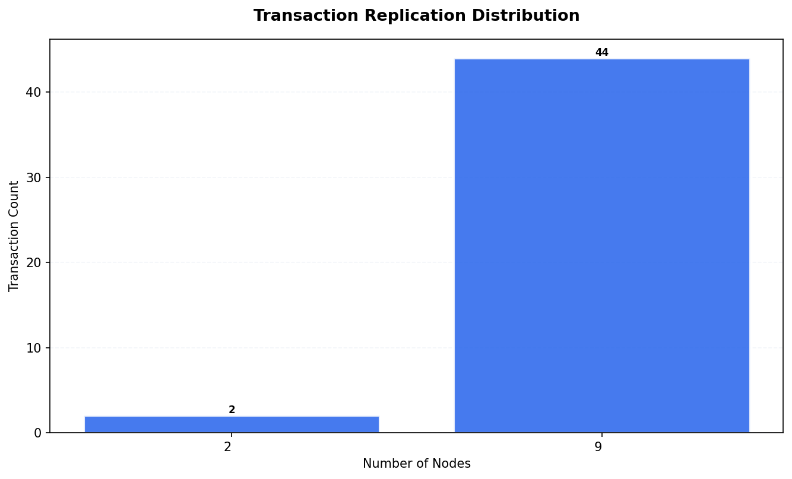

## Peer Topology

| Metric                 |   Value |
|:-----------------------|--------:|
| Total Peer Connections |      72 |
| Avg Peers per Node     |       8 |
| Isolated Nodes         |       0 |
| Peers in state 2       |      72 |

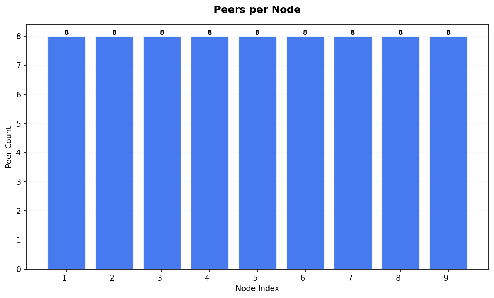

## Resource Metrics

Total metric records: 19035

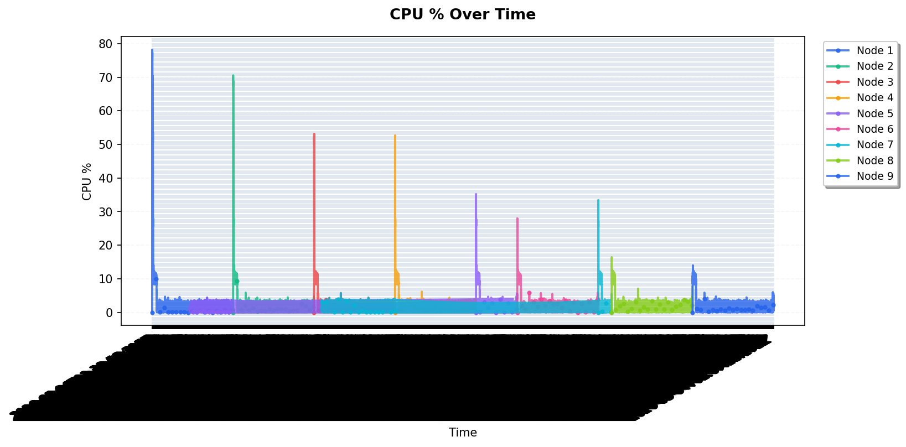

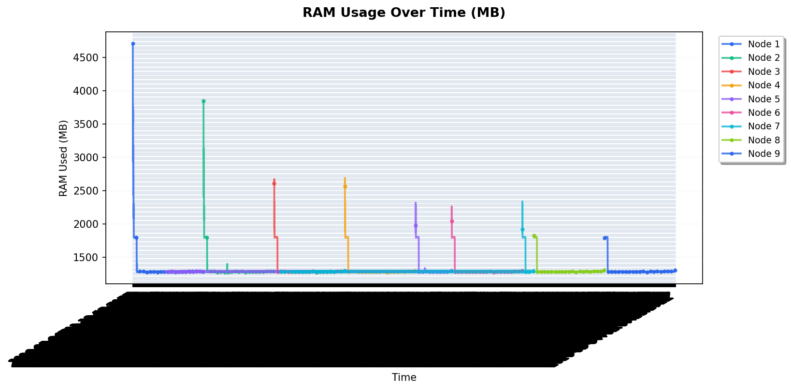

### RAM Statistics per Node

|   Node |   Avg RAM Used (MB) |   Max RAM Used (MB) |   Total RAM (MB) |
|-------:|--------------------:|--------------------:|-----------------:|
|      1 |             1325.44 |                4710 |            15661 |
|      2 |             1316.68 |                3848 |            15661 |
|      3 |             1308.32 |                2672 |            15661 |
|      4 |             1308.12 |                2690 |            15661 |
|      5 |             1306.42 |                2317 |            15661 |
|      6 |             1306.33 |                2262 |            15661 |
|      7 |             1306.4  |                2337 |            15661 |
|      8 |             1304.03 |                1824 |            15661 |
|      9 |             1303.91 |                1806 |            15661 |

## Appendix

| Field           | Value                      |
|:----------------|:---------------------------|
| Generated At    | 2026-05-04T02:12:44.908955 |
| Script Version  | 1.0.0                      |
| Database Path   | /data/db.sqlite3           |
| Run ID          | 1777858179                 |
| Internal Run ID | 32                         |
| Charts Created  | 11                         |

