# Tangle Simulation Report — Run 1777860461

*Generated: 2026-05-04T02:45:50.918034*

*Script version: 1.0.0*

---

## Run Summary

| Metric               | Value               |
|:---------------------|:--------------------|
| Run ID               | 1777860461          |
| Status               | complete            |
| Started              | 2026-05-04 02:07:41 |
| Ended                | 2026-05-04 02:45:49 |
| Duration             | 0:38:08             |
| Node Count (params)  | 10                  |
| Tx Count (params)    | 5                   |
| Tx Delay (ms)        | 300                 |
| Max Peers            | 5                   |
| PoW                  | 1                   |
| Wait (ms)            | 600                 |
| Total Nodes (actual) | 10                  |
| Total Transactions   | 408                 |
| Unique Transactions  | 51                  |
| Total Hops           | 922                 |
| Total Peers          | 90                  |
| Metrics Records      | 21155               |

## Node Overview

|   Index | Node ID                 |   Tx Count |   Peer Count |   Has Metrics |
|--------:|:------------------------|-----------:|-------------:|--------------:|
|       1 | wTE07/h4pux3475v+3Ub... |         51 |            9 |             1 |
|       2 | BmwHEE23IFgF/J3HzmxW... |         51 |            9 |             1 |
|       3 | xVoh2cnESKML4whS/6xC... |         48 |            9 |             1 |
|       4 | RitAhVXQvunFEi01G9/X... |         48 |            9 |             1 |
|       5 | x3n7g/cGebEf4peXCy/Y... |         48 |            9 |             1 |
|       6 | 7CV3Wv/o46avXebvd0ap... |         48 |            9 |             1 |
|       7 | zi/0c4hfqKK7BJ+niVLu... |         48 |            9 |             1 |
|       8 | tokPRCzLSrsZ3oFgJGyH... |         22 |            9 |             1 |
|       9 | FZKWhNo3lvvAkS+PE0x6... |         22 |            9 |             1 |
|      10 | keVJfblAmYKjbIfBy5cA... |         22 |            9 |             1 |

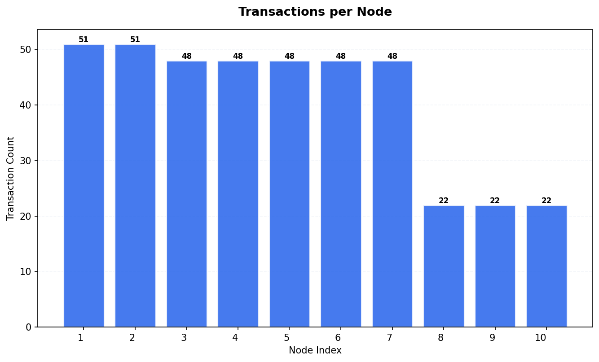

## Transaction Timing Statistics

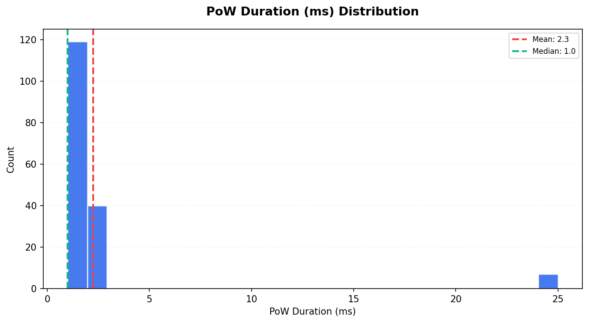

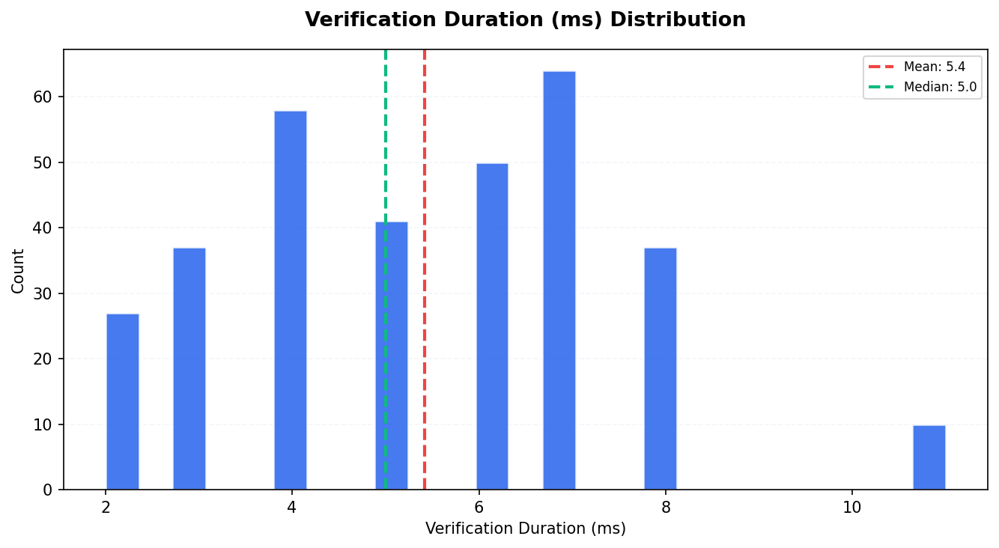

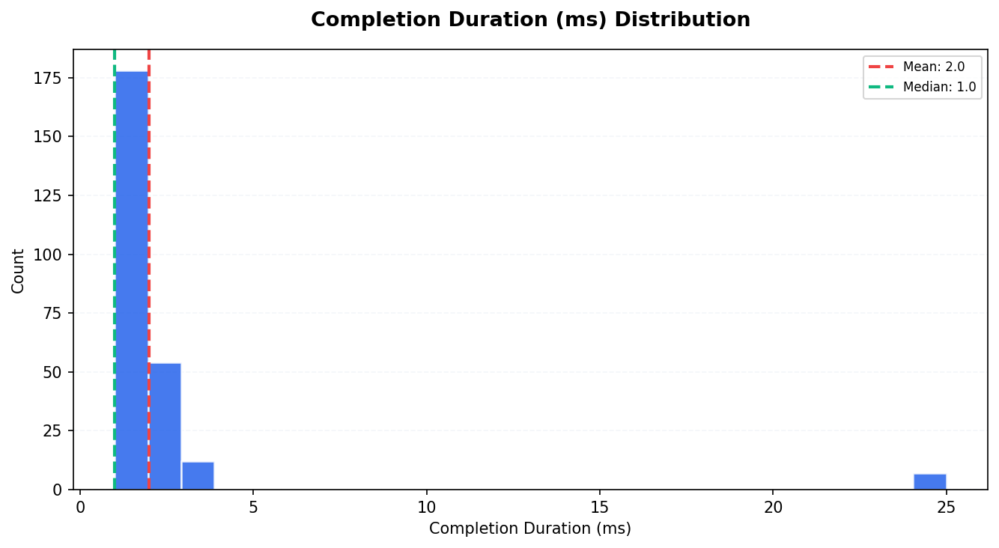

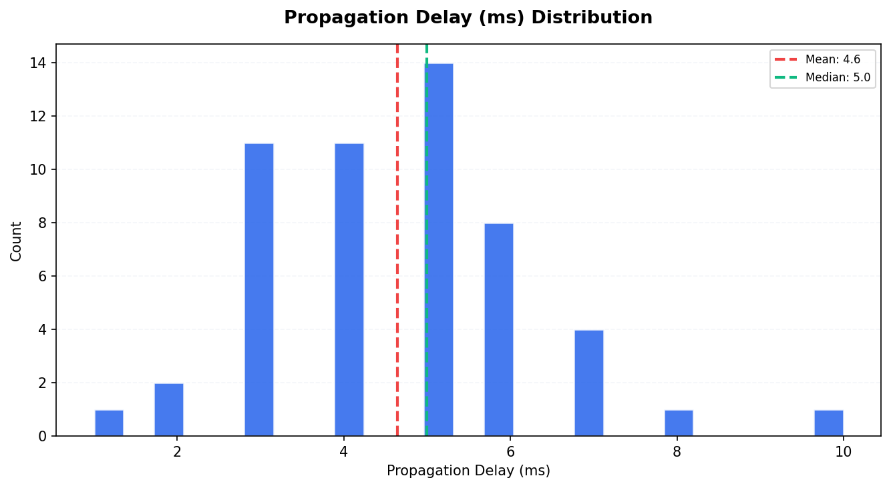

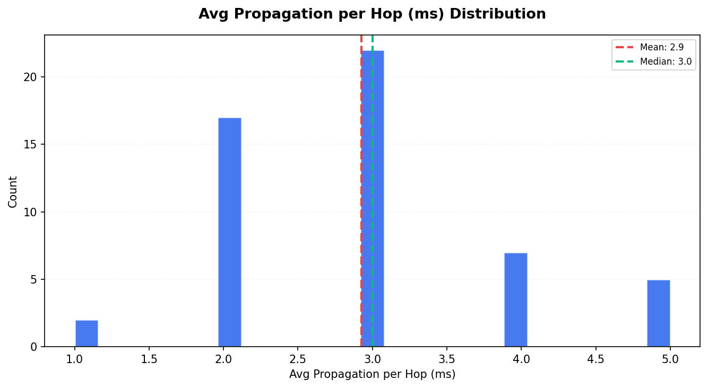

| Metric                       |   Count |   Mean |   Median |   P95 |
|:-----------------------------|--------:|-------:|---------:|------:|
| PoW Duration (ms)            |     166 |   2.25 |        1 |     2 |
| Consensus Duration (ms)      |       0 |   0    |        0 |     0 |
| Verification Duration (ms)   |     324 |   5.42 |        5 |     8 |
| Completion Duration (ms)     |     251 |   1.98 |        1 |     3 |
| Propagation Delay (ms)       |      53 |   4.64 |        5 |     7 |
| Avg Propagation per Hop (ms) |      53 |   2.92 |        3 |     5 |

## Consistency Analysis

| Metric                  | Value   |
|:------------------------|:--------|
| Consistency Score       | 43.14%  |
| Fully Replicated Tx     | 22      |
| Partially Replicated Tx | 29      |
| Total Unique Tx         | 51      |
| Parent Conflicts        | 0       |
| Signature Conflicts     | 0       |
| Data Conflicts          | 0       |
| Weight Differences      | 14      |
| Consensus Differences   | 0       |

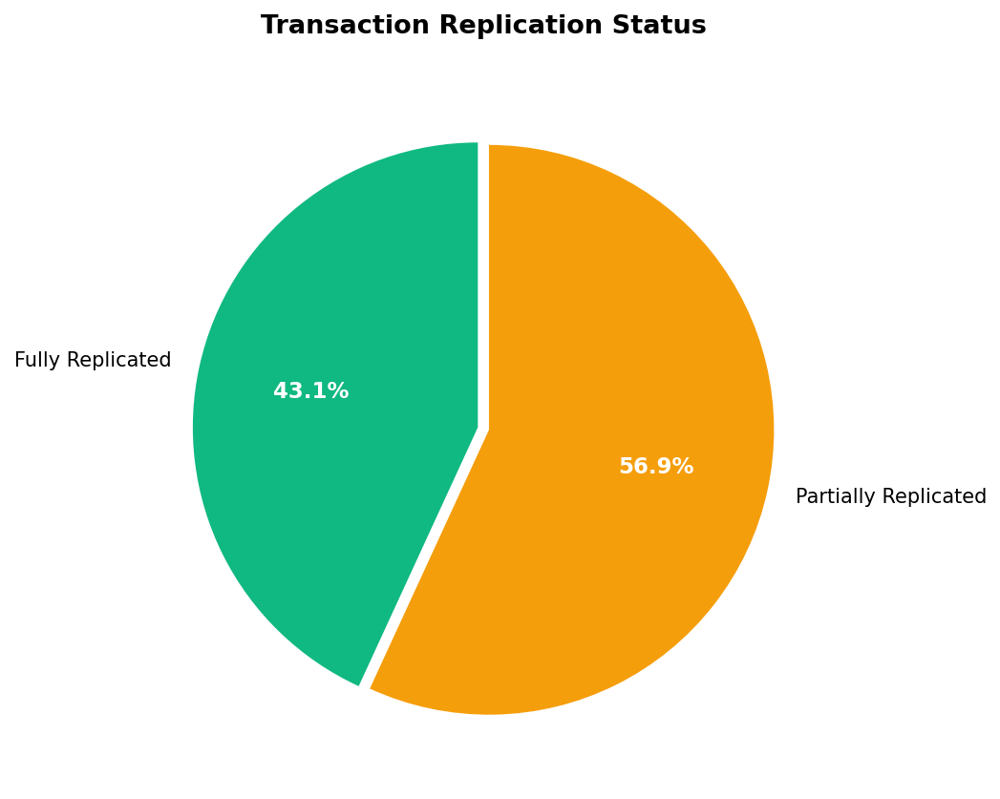

### Replication Distribution

How many nodes have each transaction:

| Node Count   |   Transactions |
|:-------------|---------------:|
| 2 nodes      |              3 |
| 7 nodes      |             26 |
| 10 nodes     |             22 |

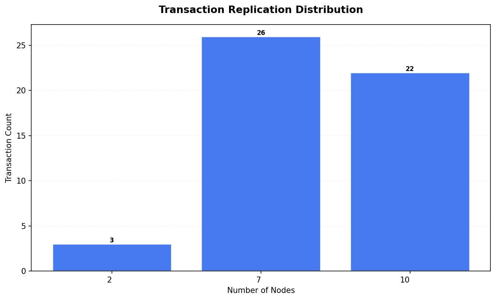

## Peer Topology

| Metric                 |   Value |
|:-----------------------|--------:|
| Total Peer Connections |      90 |
| Avg Peers per Node     |       9 |
| Isolated Nodes         |       0 |
| Peers in state 2       |      90 |

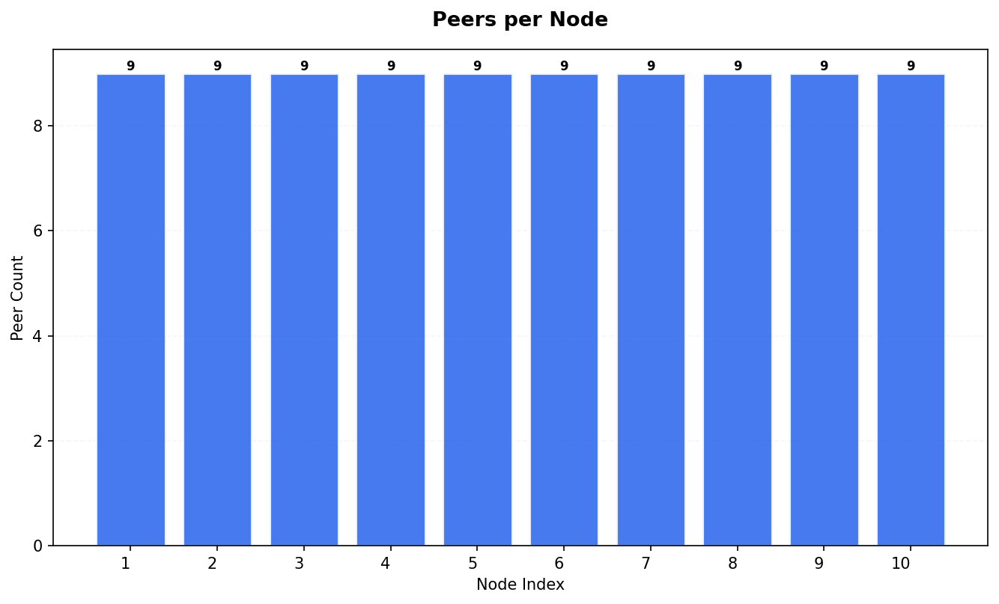

## Resource Metrics

Total metric records: 21155

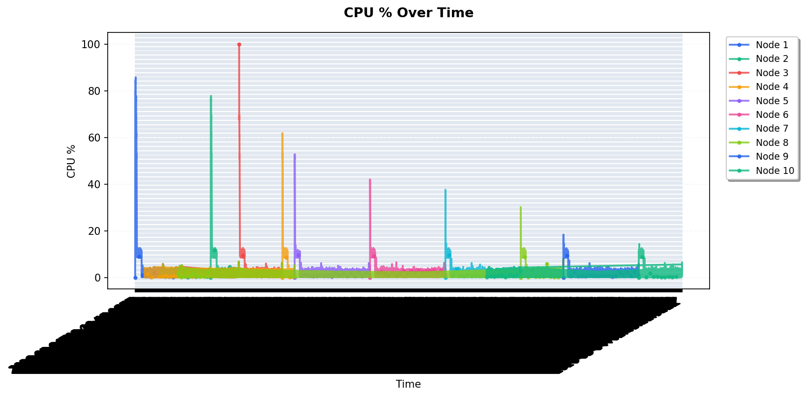

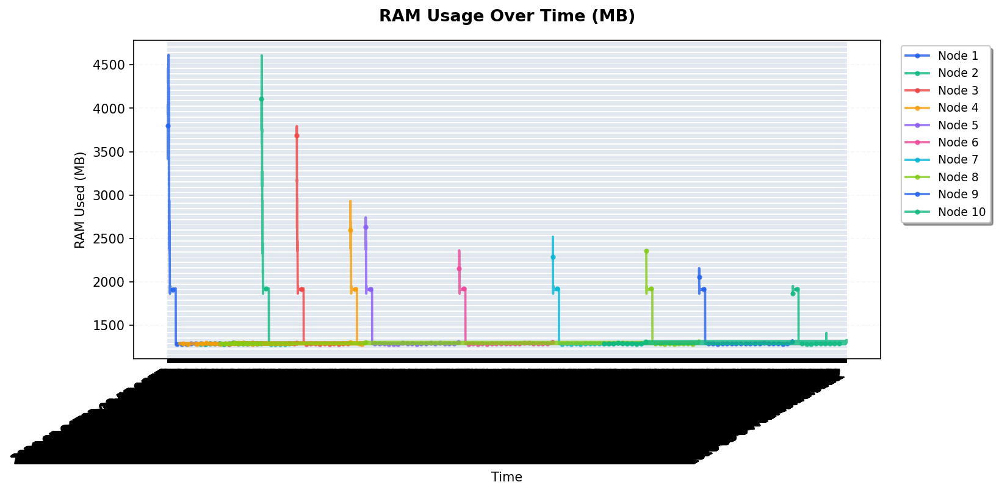

### RAM Statistics per Node

|   Node |   Avg RAM Used (MB) |   Max RAM Used (MB) |   Total RAM (MB) |
|-------:|--------------------:|--------------------:|-----------------:|
|      1 |             1378.12 |                4616 |            15661 |
|      2 |             1359.59 |                4610 |            15661 |
|      3 |             1343.97 |                3795 |            15661 |
|      4 |             1338.26 |                2933 |            15661 |
|      5 |             1336.35 |                2744 |            15661 |
|      6 |             1333.03 |                2365 |            15661 |
|      7 |             1333.2  |                2521 |            15661 |
|      8 |             1331.7  |                2357 |            15661 |
|      9 |             1330.81 |                2159 |            15661 |
|     10 |             1330.05 |                1954 |            15661 |

## Appendix

| Field           | Value                      |
|:----------------|:---------------------------|
| Generated At    | 2026-05-04T02:49:55.984590 |
| Script Version  | 1.0.0                      |
| Database Path   | /data/db.sqlite3           |
| Run ID          | 1777860461                 |
| Internal Run ID | 33                         |
| Charts Created  | 11                         |

