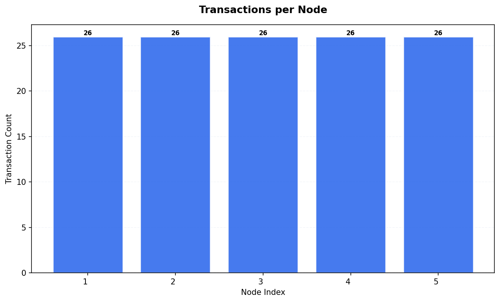
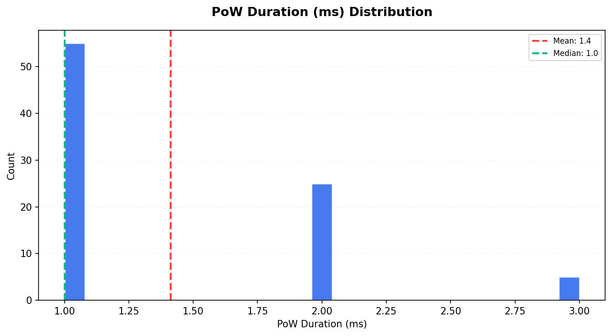
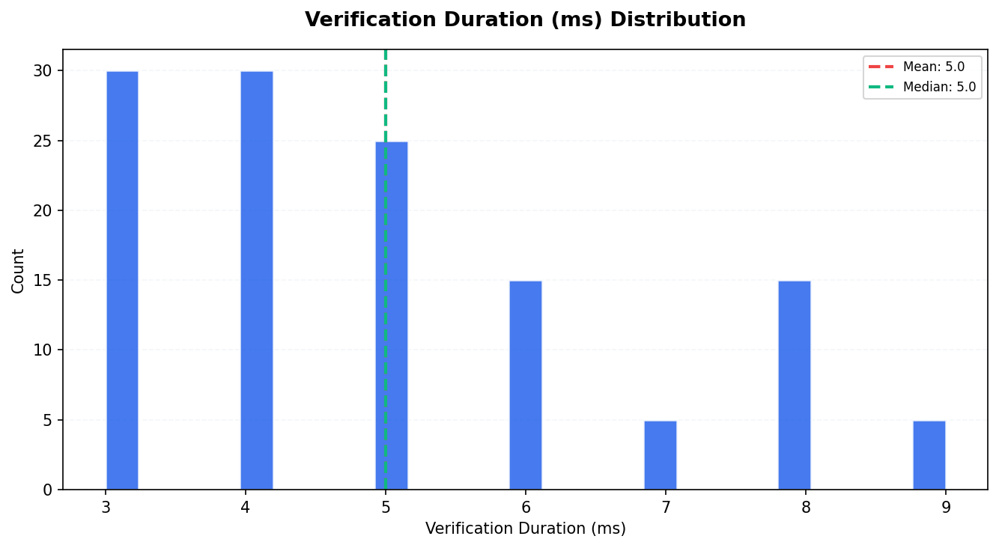
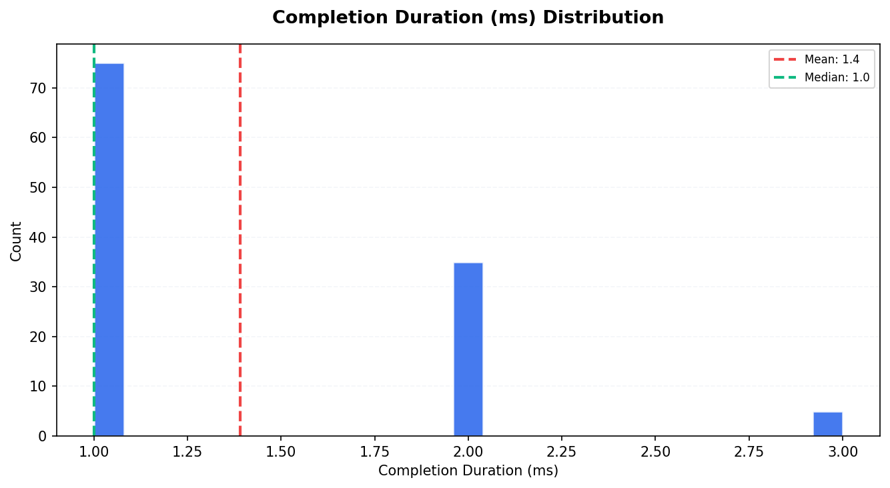
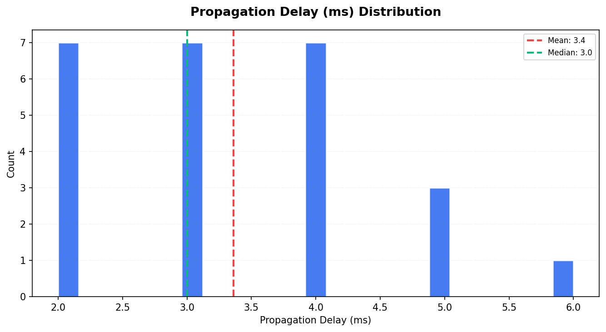
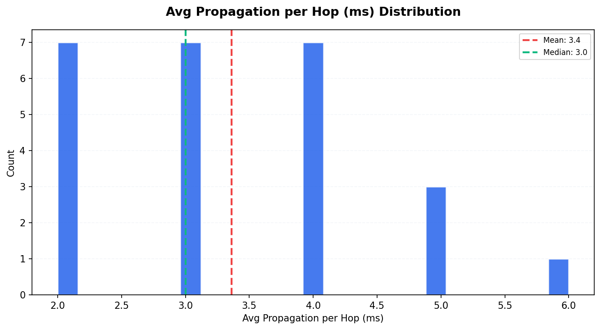
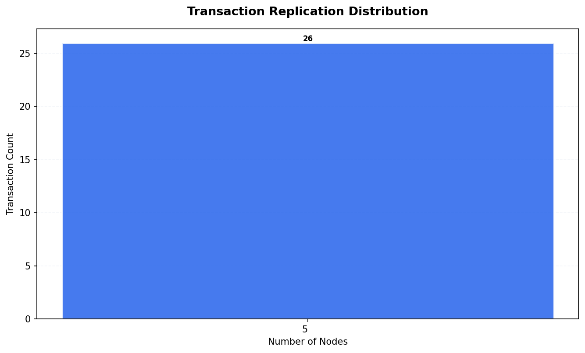
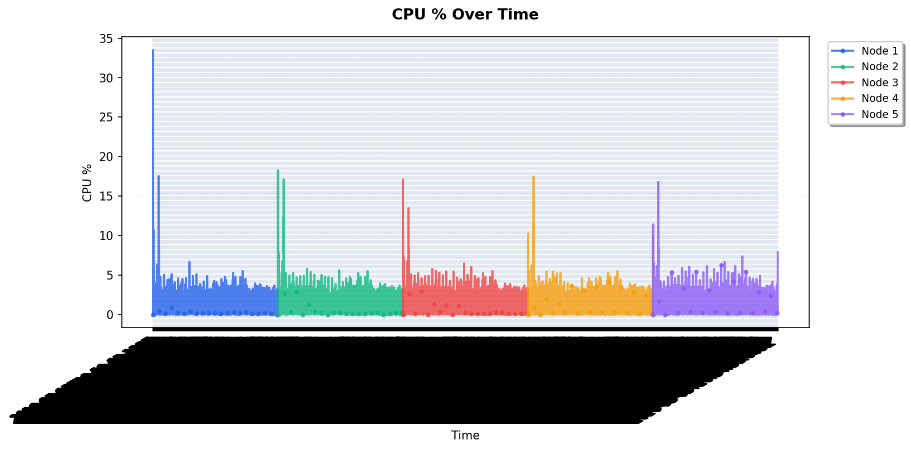
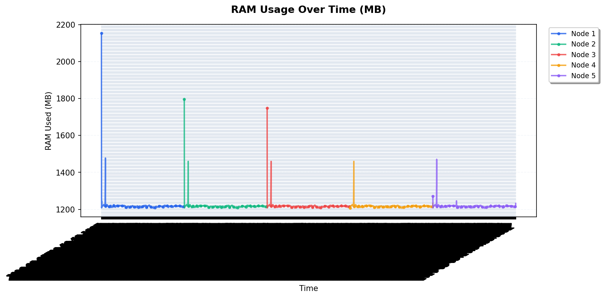

# Tangle Simulation Report — Run 1778011065

*Generated: 2026-05-05T20:35:03.149408*

*Script version: 1.0.0*

---

## Run Summary

| Metric               | Value               |
|:---------------------|:--------------------|
| Run ID               | 1778011065          |
| Status               | complete            |
| Started              | 2026-05-05 19:57:45 |
| Ended                | 2026-05-05 20:35:01 |
| Duration             | 0:37:16             |
| Node Count (params)  | 5                   |
| Tx Count (params)    | 5                   |
| Tx Delay (ms)        | 300                 |
| Max Peers            | 5                   |
| PoW                  | 1                   |
| Wait (ms)            | 600                 |
| Total Nodes (actual) | 5                   |
| Total Transactions   | 130                 |
| Unique Transactions  | 26                  |
| Total Hops           | 231                 |
| Total Peers          | 20                  |
| Metrics Records      | 10575               |

## Node Overview

|   Index | Node ID                 |   Tx Count |   Peer Count |   Has Metrics |
|--------:|:------------------------|-----------:|-------------:|--------------:|
|       1 | h/gUv/PcnL0wfUE+Hd0X... |         26 |            4 |             1 |
|       2 | WDdikvl1GTtLiBw4KT/C... |         26 |            4 |             1 |
|       3 | zUHyhHnMXO1vjURVhm3e... |         26 |            4 |             1 |
|       4 | hPfixRFlRkWF5rY2GvZz... |         26 |            4 |             1 |
|       5 | jdN/Qvp5ztyONqyDpiwc... |         26 |            4 |             1 |

## Transaction Timing Statistics

| Metric                       |   Count |   Mean |   Median |   P95 |
|:-----------------------------|--------:|-------:|---------:|------:|
| PoW Duration (ms)            |      85 |   1.41 |        1 |   2.8 |
| Consensus Duration (ms)      |       0 |   0    |        0 |   0   |
| Verification Duration (ms)   |     125 |   5    |        5 |   8   |
| Completion Duration (ms)     |     115 |   1.39 |        1 |   2   |
| Propagation Delay (ms)       |      25 |   3.36 |        3 |   5   |
| Avg Propagation per Hop (ms) |      25 |   3.36 |        3 |   5   |

## Consistency Analysis

| Metric                  | Value   |
|:------------------------|:--------|
| Consistency Score       | 100.00% |
| Fully Replicated Tx     | 26      |
| Partially Replicated Tx | 0       |
| Total Unique Tx         | 26      |
| Parent Conflicts        | 0       |
| Signature Conflicts     | 0       |
| Data Conflicts          | 0       |
| Weight Differences      | 0       |
| Consensus Differences   | 0       |

### Replication Distribution

How many nodes have each transaction:

| Node Count   |   Transactions |
|:-------------|---------------:|
| 5 nodes      |             26 |

## Peer Topology

| Metric                 |   Value |
|:-----------------------|--------:|
| Total Peer Connections |      20 |
| Avg Peers per Node     |       4 |
| Isolated Nodes         |       0 |
| Peers in state 2       |      20 |

## Resource Metrics

Total metric records: 10575

### RAM Statistics per Node

|   Node |   Avg RAM Used (MB) |   Max RAM Used (MB) |   Total RAM (MB) |
|-------:|--------------------:|--------------------:|-----------------:|
|      1 |             1217.34 |                2154 |            15661 |
|      2 |             1216.81 |                1796 |            15661 |
|      3 |             1216.69 |                1749 |            15661 |
|      4 |             1216.38 |                1460 |            15661 |
|      5 |             1216.43 |                1471 |            15661 |

## Appendix

| Field           | Value                      |
|:----------------|:---------------------------|
| Generated At    | 2026-05-05T20:38:05.645893 |
| Script Version  | 1.0.0                      |
| Database Path   | /data/db.sqlite3           |
| Run ID          | 1778011065                 |
| Internal Run ID | 34                         |
| Charts Created  | 11                         |

